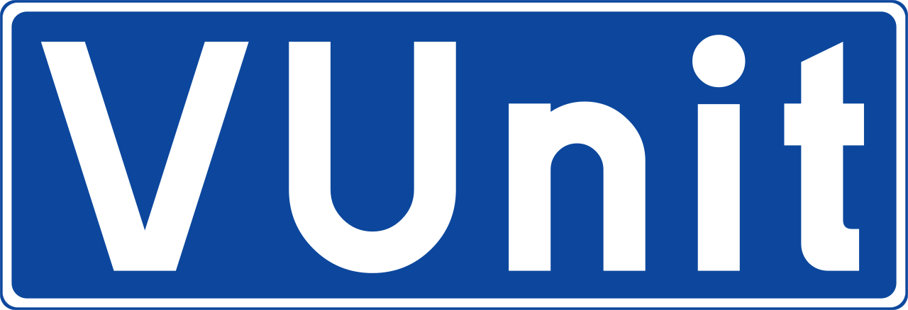

  <!--
  -->
  <!--
  -->
  <!--
  -->
  

  

  <!--
  -->
  <!--
  -->
  <!--
  -->
  <!--
  -->
  

**VUnit** is an [open source](LICENSE.rst) unit testing framework for VHDL/SystemVerilog. It features the functionality
needed to realize continuous and automated testing of your HDL code. VUnit doesn't replace but rather complements
traditional testing methodologies by supporting a *test early and often* approach through automation.
**Read more** [about VUnit](http://vunit.github.io/about.html).

Contributing in the form of code, docs, feedback, ideas or bug reports is welcome.
Read our [contributing guide](https://vunit.github.io/contributing.html) to get started.

  

