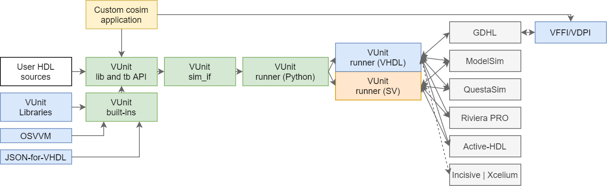

.. _about:

What is VUnit?
==============

VUnit is an open source unit testing framework for VHDL/SystemVerilog released under the terms of `Mozilla Public
License, v. 2.0`_.
It features the functionality needed to realize continuous and automated testing of your HDL code.
VUnit doesn't replace but rather complements traditional testing methodologies by supporting a *"test early and often"*
approach through automation.

VUnit reduces the overhead of testing by supporting automatic discovery of test benches and compilation order as well
as including libraries for common verification tasks.
It improves the speed of development by supporting incremental compilation and by enabling large test benches to be
split up into smaller independent tests.
It increases the quality of projects by enabling large regression suites to be run on a continuous integration server.

VUnit does not impose any specific verification methodology on its users.
The benefits of VUnit can be enjoyed when writing tests first or last, when writing long running top level tests or
short running unit tests, when using directed or constrained random testing.
Often projects adopt mix of approaches for different testing needs.
VUnit has been used in production environments where thousands of tests take several hours to run on powerful multi-core
machines as well as in small open source projects where only a small package is tested in a few seconds.

Main Features
-------------

* :ref:`Scriptable API <python_interface>` as well as :ref:`command line <cli>` support.

  * Has ``--gui`` switch to launch test cases in the simulator GUI when debugging is necessary.

* Automatic scanning of files for tests, file dependencies, and file changes enable automatic (incremental)
  (re)compilation and execution of test suites.

* Python test suite runner that enables powerful test administration:

  * Can continue testing after fatal run-time errors (e.g. division by zero).
  * Ensures test case independence.
  * Can run test cases in parallel to take advantage of multi-core machines.
  * Support for running test benches with multiple generic/parameter settings.
  * Requirements trace-ability through :ref:`JSON Export <json_export>` and :ref:`test attributes <attributes>`.
  * Outputs JUnit report files for better `Jenkins`_ :ref:`integration <continuous_integration>`.
  * Builds on the commonly used `xUnit`_ architecture.

* :ref:`Built-in HDL utility libraries <hdl_libraries>`:

  * :doc:`Run library <./run/user_guide>` providing functionality for declaring multiple test cases within HDL
    testbenches.
  * :doc:`Assertion checker library <./check/user_guide>` that extends VHDL built-in support (assert).
  * :doc:`Logging framework <./logging/user_guide>` supporting display and file output, different log levels, visibility
    settings of levels and design hierarchy, output formatting and multiple loggers.
    Supports machine readable output formats that for example can be read by a spreadsheet.

      * For simulartors without VHDL 2019 call path support, an optional location preprocessor traces log and check
        calls back to file and line number.

  * Convenient :doc:`Data Types <./data_types/user_guide>` to deal with queues and/or dynamic arrays of integers in up
    to three dimensions.
  * :doc:`Communication library <./com/user_guide>` providing a high-level communication mechanism based on the
    `actor model <http://en.wikipedia.org/wiki/Actor_model>`__.
  * :doc:`Verification Components library <./verification_components/user_guide>` providing verification components (VCs)
    for interfaces such as AXI, Avalon or Wishbone, along with utilities for writing your own self-checking VCs.
  * Third-party submodules:

    * `OSVVM <https://github.com/OSVVM/OSVVM>`__
    * `JSON-for-VHDL <https://github.com/Paebbels/JSON-for-VHDL>`__

Overview
--------

  Block diagram of VUnit.

The core of VUnit is the Python plumbing composed by the library and testbench API, the simulator interfaces and the
runner for interacting with HDL testbenches.
Sibling ``run`` HDL libraries allow specifying tests within testbenches.

Moreover, VUnit includes multiple optional HDL libraries, along with third-party resources such as OSVVM and JSON-for-VHDL.
Those are made available through the built-ins API, which is based on the library and testbench API.

Both the core and builtins are available in the public :ref:`python_interface` of VUnit.
Details about how to execute a project are explained in :ref:`cli`.
Further info about the optional libraries is found in :ref:`hdl_libraries`.

Experimental co-simulation through GHDL's VHPIDIRECT is supported in `VUnit/cosim <https://vunit.github.io/cosim/>`__.

Getting Started
---------------

There are a number of ways to get started.

-  :ref:`VUnit User Guide <user_guide>` will guide users on how to start using the basic features of VUnit but also
   provides information about more specific and advanced usage.
-  :ref:`Run Library User Guide <run_library>` presents the run packages.
-  :ref:`Check Library User Guide <check_library>` presents the check packages.
-  :ref:`Logging Library User Guide <logging_library>` presents the log packages.
-  There are also various presentations of VUnit on `YouTube`_.
   For example `an introduction to unit testing (6 min)`_ and a `short introduction to VUnit (12 min)`_.

Support
-------

Any bug reports, feature requests or questions about the usage of VUnit can be made by creating a `new issue`_.

Credits and License
-------------------

Substantial contributors are shown in the table below, but many others contributed with minor patches.
Find a list at `github.com/VUnit/vunit/graphs/contributors <https://github.com/VUnit/vunit/graphs/contributors>`__.

With apologies to anyone who ought to be either on this table or in the GitHub contributor list, but isn't.
Thanks also to all those who have reported bugs and support issues, and often patches and testcases.

================================================================================ ================================================================================================================================================================================================
Contributor [#f1]_                                                               Role
================================================================================ ================================================================================================================================================================================================
Asplund, Lars [`@LarsAsplund <https://github.com/LarsAsplund>`__] [#f2]_         Founder and main author of VUnit as a whole
Kraigher, Olof [`@kraigher <https://github.com/kraigher>`__]                     Founder and main author of VUnit until v4
Marquardt, Colin [`@cmarqu <https://github.com/cmarqu>`__]                       Cadence Incisive support
Martinez-Corral, Unai [`@umarcor <https://github.com/umarcor>`__] [#f2]_         Continuous Integration (CI), Co-simulation with GHDL's VHPIDIRECT interface (`VUnit/cosim <https://github.com/VUnit/cosim>`_, based on `ghdl/ghdl-cosim <https://github.com/ghdl/ghdl-cosim>`_)
Siluk, Sławomir [`@slaweksiluk <https://github.com/slaweksiluk>`__]              Verification Components (such as Avalon and Wishbone)
================================================================================ ================================================================================================================================================================================================

.. [#f1] In alphabetical order
.. [#f2] Maintainer

.. include:: license.rst

.. _xUnit: http://en.wikipedia.org/wiki/XUnit
.. _Jenkins: http://jenkins-ci.org/
.. _YouTube: https://www.youtube.com/channel/UCCPVCaeWkz6C95aRUTbIwdg
.. _an introduction to unit testing (6 min): https://www.youtube.com/watch?v=PZuBqcxS8t4
.. _short introduction to VUnit (12 min): https://www.youtube.com/watch?v=D8s_VLD91tw
.. _new issue: https://github.com/VUnit/vunit/issues/new
