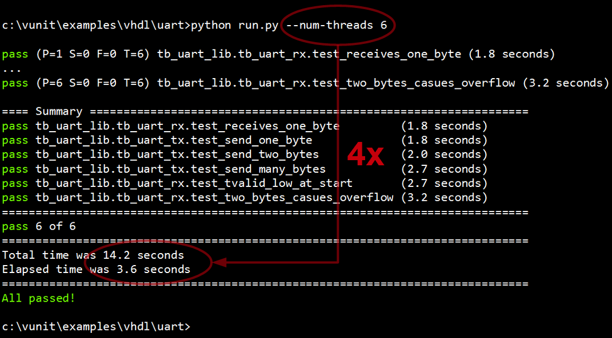

:tags: VUnit
:author: lasplund
:excerpt: 2

.. _short_introduction_to_vunit_post:

Short Introduction to VUnit
===========================
**Originally posted and commented on** `LinkedIn <https://www.linkedin.com/pulse/short-introduction-vunit-lars-asplund?trk=mp-author-card>`_.

`VUnit <https://github.com/VUnit/vunit>`__ is a free and open source
unit testing framework for VHDL that was released in November last year.
Initially it supported ModelSim, then GHDL support was added in June,
and a few days ago we added support for Active-HDL and Riviera-PRO. The
latest addition makes the tool available for a new group of users and
this is a short introduction for you.

The basic idea with unit testing is to code and test in short cycles to
get frequent feedback on progress from day one. Most of us add bugs many
times a day so we need to complete these cycles at the same pace to
limit the consequences. If we're going to test many times a day, not
only what we just added but also do regression testing, it has to be an
automated and speed optimized task.

Automation means that our testbenches and their test cases have to be
self-checking but also that we need to automate the execution all these
tests or a selected subset thereof. As soon as we introduce manual steps
in this workflow we tend to postpone the testing and the short code/test
cycle is broken.

VUnit provides a :vunit_file:`check package <vunit/vhdl/check/user_guide.md>`
for making tests self-checking and the :vunit_file:`test runner <user_guide.md>`
is responsible for the execution. The test runner will scan your project
directories for source files and tests, figure out their dependencies
and what have been modified, compile what's needed and then run the
selected tests as specified from command line. For example,

.. code:: console

    # Incrementally compile and run all testbenches and test cases found.
    # Report pass/fail result for each.
    $ python run.py
    test case

    # Run all test cases in testbench tb_foo
    $ python run.py *tb_foo*

    # Speed up the test by running the test cases in 6 parallel threads.
    # Make use of all the CPU cores!
    $ python run.py -p 6 *tb_foo*

    # Launch the tb_foo test case "Test that reset initializes all outputs" in the simulator GUI such that it can be debugged
    $ python run.py --gui "*tb_foo.Test that reset initializes all outputs"

VUnit is lightweight. A typical setup adds 8 lines to your normal
testbench code and one extra line for each test case in that testbench.
Everything is pure VHDL so it can be run without the run.py script if
you want to. The typical run.py script is 4 lines of code plus one extra
line for each VHDL library you want to create and each directory where
you want the test runner to scan for source files. You don't have to
know Python, just start with a the template and insert your library
names and source paths.

In addition to the core functionality described above VUnit contains a
number of other useful features. For example,

-  A message passing mechanism that enables high-level communication
   between testbench components. It allows you to send almost any type
   of data to anyone located anywhere. All you have to deal with is the
   name of the receiver and what data to send. The strongly typed nature
   of VHDL has been hidden which means that you can send data of a
   custom type using the provided send procedure. You don't have to
   define your own procedures for every data/message type you create.
   Message passing can be used for sending transactions without some of
   the limitations of pin-wiggling and procedure-based transactions but
   it is also the basis for several other communication patterns. For
   more info see the :vunit_file:`com user guide <vunit/vhdl/com/user_guide.md>`.

-  An array package that can handle multidimensional arrays. It's
   typically used for input and output data sets to the DUT. The package
   supports reading/writing arrays from/to file which enables file-based
   testing. For more information see this :vunit_example:`example <vhdl/array`.

-  A general purpose logging framework supporting display and file
   output, different output levels, filtering on level and design
   hierarchy, output formatting, automatic file and line localization of
   log entries, multiple loggers, and spreadsheet tool integration. For
   more information see the :vunit_file:`logging user guide <vunit/vhdl/logging/user_guide.md>`.

VUnit is a truly open project formed by its community. If you want to
follow the progress you can click on "watch" on the project
`homepage <https://github.com/VUnit/vunit>`__. If you like what you see
click on "star". If it's something you don't like or you miss a feature
you should create an `issue <https://github.com/VUnit/vunit/issues>`__.
You can also make your own code :vunit_file:`contributions <developing.md>`.
