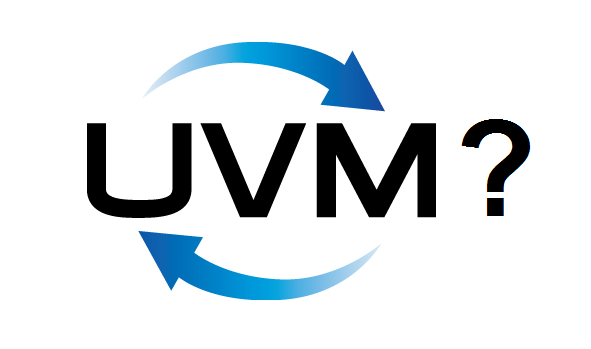

:tags: VUnit
:author: lasplund
:excerpt: 2

Who's Using UVM (or Not) for FPGA Development, and Why?
=======================================================

**Originally posted and commented on** `LinkedIn
<https://www.linkedin.com/pulse/whos-using-uvm-fpga-development-why-lars-asplund?trk=mp-author-card>`__.

Over the last few years a number of open source test solutions have
emerged. I'm talking about tools like our
`VUnit <https://github.com/VUnit/vunit>`__ but also others like
`OSVVM <http://osvvm.org/>`__,
`Cocotb <https://github.com/potentialventures/cocotb>`__,
`BVUL <http://bitvis.no/products/bitvis-utility-library/>`__, and
`SVUnit <http://www.agilesoc.com/open-source-projects/svunit/>`__. The
people developing these tools all had the question:

*Why are you doing this? Why not use UVM?*

These questions often come from people promoting UVM so it becomes a
discussion among people heavily involved in one solution or the other.
This time I would like to hear the opinions of the larger community. Why
did you decide to use UVM for your FPGA development? Why did you decide
not to? Maybe you're using UVM for parts of the testing but not all?

All tools can be used for ASIC development but I think the question is
more interesting when talking about FPGAs so let's focus on that for
now. I welcome the people developing these tools to answer as well but
please state who you are.
