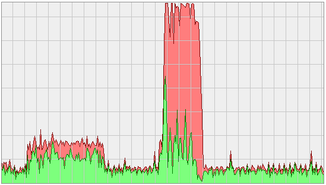

:tags: VUnit
:author: lasplund
:excerpt: 2

Free and Open Source Verification with VUnit and GHDL
=====================================================
**Originally posted and commented on** `LinkedIn
<https://www.linkedin.com/pulse/free-open-source-verification-vunit-ghdl-lars-asplund?trk%20=pulse_spock-articles>`__.

`VUnit <https://github.com/VUnit/vunit>`__ is a free and open source
(FOSS) unit testing framework for VHDL that supports ModelSim,
Rivera-PRO, GHDL, and Active-HDL. GHDL is a FOSS simulator which VUnit
started to support 6 months ago but until recently you had to build GHDL
yourself from source code to get a version working with VUnit. This was
inconvenient and made it harder to get started but with the official
release of GHDL 0.33 this is no longer an issue and you can
`download <http://sourceforge.net/projects/ghdl-updates/files/Builds/ghdl-0.33/>`__
binary builds directly.

A free simulator opens up a number of possibilities. For example, you
can continue to develop new code and interact with your favorite
simulator while GHDL is running your regression tests in the background
on the other CPU cores. With VUnit you can simply do

.. code-block:: console

    $ python run.py -p 7

to start running your test cases in 7 parallel threads and make use of
all your processing power. The image above shows the load difference
between just running a simulation in my normal simulator (the first load
peak) and also running 7 threads of VUnit test cases in the background
with GHDL (second 100% load peak).

If you're new to VUnit and want more information I recommend that you
start with this short :ref:`introduction
<short_introduction_to_vunit_post>`.
