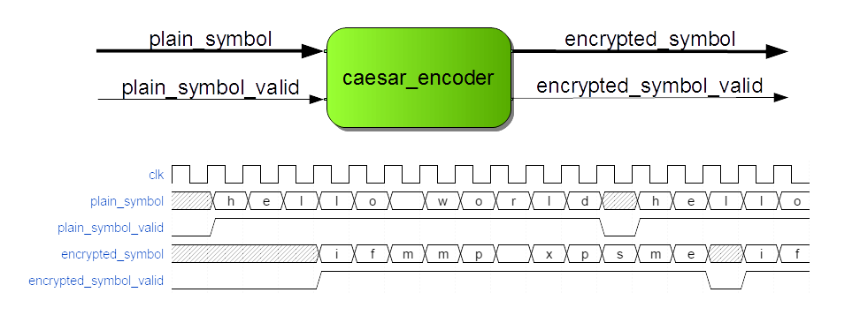
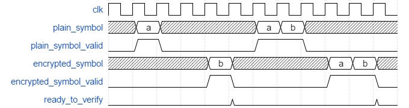
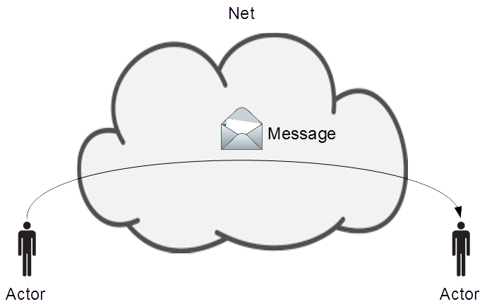
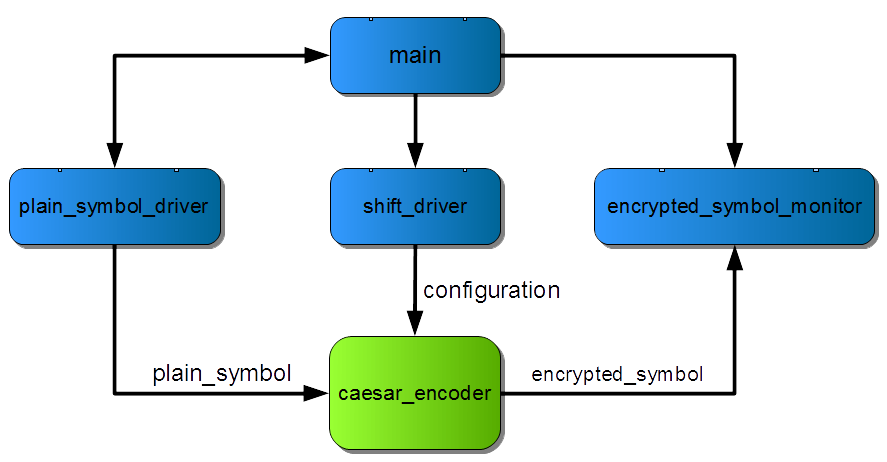

:tags: VUnit
:author: lasplund
:excerpt: 1
:image: 1

Improving VHDL Testbench Design with Message Passing
====================================================

Building Spaghetti Towers
-------------------------

Some time ago me and my colleagues at `Synective
Labs <http://www.synective.se>`__ did a teamwork exercise called the
`Marshmallow Challenge <http://www.marshmallowchallenge.com>`__. The
challenge is to build the tallest structure that can hold a
marshmallow from twenty sticks of spaghetti, one yard of tape and one
yard of string. The structure must be completed within 18 minutes.
Many teams with various backgrounds have taken this challenge and a
number of
`observations <http://marshmallowchallenge.com/TED_Talk.html>`__ have
been made:

- Engineers and architects have an advantage with their
  special skills and they build the tallest structures.
- Kindergartners perform better than average despite their lack of
  such skills. The reason is that they start prototyping to figure out
  what works and what doesn't and then iterate to refine their designs.
- Business students have an average height that is just half of the
  average for all teams. They are trained to create a *single* right
  plan from which they execute. With such a strategy there is a single
  attempt to put the marshmallow on top of the structure right before
  the deadline and that attempt often fails.
- Teams with someone like
  an executive administrator, a member focused on coordinating the work
  of the others, improving on timing and communication, will do
  significantly better.

When I did the challenge I was part of a team with three engineers and
the company administrator. We did some up front thinking but didn't wait
long to put our ideas to the test. From there we iterated our way
forward to the final structure. Need I say who won the challenge?

Tom Wujec who made a `TED
talk <https://www.ted.com/talks/tom_wujec_build_a_tower>`__ on this
challenge has also made some other interesting TED talks. For example
`Got a wicked problem? First, tell me how you make
toast <https://www.ted.com/talks/tom_wujec_got_a_wicked_problem_first_tell_me_how_you_make_toast>`__
which is about the power of visualization, how much easier it is to
understand a system if it can be represented by a drawing, and how you
can create such a drawing.

Implications on Testbench Design
--------------------------------

Looking at these presentations made think about VHDL testbench design.
Rather than a number of team members cooperating on a spaghetti tower we
have a number of concurrent processes cooperating around the
verification of a piece of VHDL code. With several processes (or other
concurrent statements) spread across your source file(s) the intent of
the testbench is hard to grasp unless you have one process that
coordinates the others. That process is the executive administrator of
the team and the "drawing" visualizing the big picture for what the
testbench does.

Just as communication and timing is important within a team it's also
important that the testbench processes can communicate efficiently and
are properly synchronized. Managing that communication and
synchronization must also be simple such that it can be easily refined
when working with iterations. However, synchronization is one of the
things with concurrent programming that is notoriously hard to get right
even though it comes natural for the members of the Marshmallow
Challenge teams

-  It's not common that two team members reach for the same stick of
   spaghetti and break it. We instinctively pull back to handle this
   `race condition <https://en.wikipedia.org/wiki/Race_condition>`__.
-  It's not likely that a team comes to
   `deadlock <https://en.wikipedia.org/wiki/Deadlock>`__ indefinitely
   because one member is sitting with the string waiting for the tape
   while the member holding the tape sits waiting for the string.
-  If one member is producing triangular building blocks for the other
   members to assemble into the larger structure and he/she completes a
   new triangle before the previous has been used, it is not likely that
   the new triangle is lost. In programming this `producer-consumer
   problem <https://en.wikipedia.org/wiki/Producer%E2%80%93consumer_problem>`__
   must be handled explicitly.

It has been
`showed <https://www.usenix.org/legacy/event/osdi10/tech/full_papers/Xiong.pdf>`__
that we can make the code less error-prone if we use standard
synchronization mechanism rather than low-level ad hoc solutions. `The
message passing mechanism provided with
VUnit <http://vunit.github.io/com/user_guide.html>`__
is an example of the former while plain VHDL often becomes an example of
the latter. For example, below are the cores of two processes which
communicate with each other using plain VHDL. The ``main`` process
provides the streaming input characters to a Caesar encryption device
using the ``encrypt`` procedure while the ``encrypted_symbol_monitor``
process verifies the output stream using the
``verify_encrypted_sentence`` procedure.

.. code-block:: vhdl

    -- Core of main process                  -- Core of encrypted_symbol_monitor process
    for i in 1 to 10 loop                    loop
      sentence <= create_random_sentence;      ready_to_verify <= true;
      wait for 0 ns;                           wait on sentence'transaction;
      encrypt(sentence);                       ready_to_verify <= false;
      wait until ready_to_verify;              verify_encrypted_sentence(sentence);
    end loop;                                end loop;

As you can see there are a lot of different wait statements and special
signalling to make this work. A slight mistake and we will encounter
both race conditions, deadlocks, and the producer-consumer problem and
these problems will only get worse if more processes are introduced.

Message passing on the other hand removes the error-prone details by
using the asynchronous ``send`` and the blocking ``receive`` procedures.
One procedure call in each process takes care of both the information
transfer and the synchronization.

.. code-block:: vhdl

    -- Core of main process                                     -- Core of encrypted_symbol_monitor process
    for i in 1 to 10                                            loop
      sentence := create_random_sentence;                         receive(net, self, message);
      send(net, encrypted_symbol_monitor, sentence, receipt);     verify_encrypted_sentence(message.payload.all);
      encrypt(sentence);                                        end loop;
    end loop;

In the coming chapters I will present in more detail the example
encryption device, what problems you may encounter when verifying such a
device using plain VHDL, how VUnit message passing works, and how it
improves the situation.

The Caesar Encryption Device
----------------------------

The figure below shows the Caesar encryption device which takes
plaintext symbols on the input while concurrently generating the
encrypted output. The device uses the Caesar cipher which substitutes
every input letter with the letter a fix number of positions down the
alphabet. This shift value equals 1 in my example so that *a* is
encrypted to *b*, *b* is encrypted to *c* and so on. The latency is
three clock cycles.

Building the Testbench
----------------------

To verify this device I would ideally have a single process testbench
where pin wiggling interface details are encapsulated in convenience
procedures. That approach would result in something like the code below
where I have a function to generate a random sentence, ``encrypt`` to
apply that sentence on the input, and ``verify_encrypted_sentence`` to
verify the correct behaviour of the output.

.. code-block:: vhdl

    -- Core of main process
    for i in 1 to 10 loop
      sentence := create_random_sentence;
      encrypt(sentence);
      verify_encrypted_sentence(sentence);
    end loop;

I'm not saying that throwing ten random sentences at this design is an
ideal way to reach functional coverage, the approach is just a simple
way of representing a testbench in which verification is based on a set
of input vectors. What I'm saying is that the testbench is very readable
and clear about its intent. I create a random sentence, encrypt the
sentence, verify the encrypted output, and repeat this ten times. This
is the "drawing" I described earlier.

Sadly, this doesn't work well for a number of reasons. For example, if
the sequence of "random" sentences is this

.. code-block:: console

    "a", "ab", "abc", "abcd", "abcd", ...

the testbench will fail on ``"abcd"`` since the first encrypted output
letter appears before the ``encrypt`` procedure had time to apply the
complete sentence. ``verify_encrypted_sentence`` will not see the first
output letter and report an error.

The common solution to this is to split the testbench into several
concurrent processes, one for each interface. So let's do that and move
``verify_encrypted_sentence`` to its own ``encrypted_symbol_monitor``
process. There are several ways to do this but an example is given
below.

.. code-block:: vhdl

    -- Core of main process                  -- Core of encrypted_symbol_monitor process
    for i in 1 to 10 loop                    loop
      sentence <= create_random_sentence;      ready_to_verify <= true;
      wait for 0 ns;                           wait on sentence'transaction;
      encrypt(sentence);                       ready_to_verify <= false;
      wait until ready_to_verify;              verify_encrypted_sentence(sentence);
    end loop;                                end loop;

This is the error-prone example I showed earlier. What would happen if I
didn't have the ``ready_to_verify`` signalling? If I forgot waiting for
0 ns? If I didn't include the transaction attribute on the right-hand
wait statement?

Despite the efforts the testbench is still lacking important abilities.
For example, the producer-consumer problem we may experience is because
``encrypted_symbol_monitor`` can only consume one sentence at a time. If
we didn't have the ``ready_to_verify`` signal ``main`` would produce a
new sentence before ``verify_encrypted_sentence`` has verified the
previous. The new sentence is missed by ``encrypted_symbol_monitor``
since it isn't at the wait statement ready to receive it. The
``ready_to_verify`` solution prevents this by having ``main`` wait for
``verify_encrypted_sentence`` to complete but it also means that two
sentences are separated by four clock cycles, as shown in the figure
below, and we never verify the situation in the hello world example
shown previously where the sentences are separated with a single clock
cycle.

To address this we need a queue between ``main`` and
``encrypted_symbol_monitor`` where new sentences can wait while previous
sentences are being verified. ``main`` can now pass information to
``encrypted_symbol_monitor`` without waiting for it to be ready. This is
known as `asynchronous message
passing <https://en.wikipedia.org/wiki/Message_passing>`__. If we can
package the concept of message passing into a higher level
synchronization primitive we do not only solve our problem but we also
remove the low-level details of our ad hoc solution which reduces the
risk of bugs.

Introducing Message Passing
---------------------------

The `VUnit <http://vunit.github.io>`__ test framework includes a
`com
package <http://vunit.github.io/com/user_guide.html>`__
providing such a message passing mechanism. The abstraction used is that
we have *actors* (from the `actor
model <https://en.wikipedia.org/wiki/Actor_model>`__) which communicates
with each other using *messages* sent over an abstract communication
medium called the *net*.

The code below shows how the ``encrypted_symbol_monitor`` process makes
use of the message passing mechanism. It creates an actor for itself by
calling ``create`` with the name for that actor. ``create`` returns a
reference to the actor which I assigned to a process local constant
``self``. That reference is then used in subsequent calls related to the
message passing mechanism. For example, the core of the process starts
by blocking at the ``receive`` procedure waiting for a message to be
sent over the net to this actor. The payload of that message is the
sentence we want to verify.

.. code-block:: vhdl

    -- Local declarations of encrypted_symbol_monitor process
    constant self : actor_t := create("encrypted symbol monitor");

    -- Core of encrypted_symbol_monitor process
    receive(net, self, message);
    verify_encrypted_message(message.payload.all);

The updated code for the ``main`` process finds the reference to the
``encrypted_symbol_monitor`` actor by using its name. That reference is
used as the receiver when sending a message containing the newly created
sentence.

.. code-block:: vhdl

    -- Local declarations of main process
    constant encrypted_symbol_monitor : actor_t :=  find("encrypted symbol monitor");

    -- Core of main process
    for i in 1 to 10
      sentence := create_random_sentence;
      send(net, encrypted_symbol_monitor, sentence, receipt);
      encrypt(sentence);
    end loop;

A few things to note:

- The ``send`` call doesn't consume physical time, only delta cycles. The message produced by the sender is placed in a queue until the receiver is ready to consume it.
- The ``create``, ``find``, ``send``, and ``receive`` subprograms are taken directly from the com package so there is no need for any additional code to make this work.
- The producer-consumer problem is solved and sentences can be encrypted back-to-back.
- The error-prone low-level VHDL code is removed.
- Isn't there a race condition if the call to ``find`` is made before the actor is created with ``create``? No, the com package will handle this as described in the `user guide <http://vunit.github.io/com/user_guide.html>`__.
- I've created two references to the same actor (the ``self`` and ``encrypted_symbol_monitor`` constants) instead of using a global reference. The reason is that it makes me indifferent to the location of the referenced actor. If I want to make a component out of the ``encrypted_symbol_monitor`` process such that it can be reused in other testbenches I would have to make a global reference visible to several source files, for example by putting the reference in a package used by relevant source files. This would get me involved in the transport of information between sender and receiver and I would like to avoid that for the reason mentioned. Compare this to the original plain VHDL ``encrypted_symbol_monitor`` process. If I wanted to move that into a separate component I would be responsible for all involved signals and ports and the routing in between.
- I didn't create an actor for the ``main`` process. It's not necessary when I'm not sending messages in that direction.
- In this case each actor represents a process but it's is not limited to that. For example, if you want a process with several communication channels with different priorities you can let an actor represent a channel.
- The com implementation has many variables but only one signal, ``net``, while the typical ad hoc implementation has more. As a result the com-based solution simulates faster.

What I presented so far is the basic functionality for the com package.
A description of all features can be found in the `user
guide <http://vunit.github.io/com/user_guide.html>`__
but I'll give a few more examples by adding some extra functionality to
the testbench.

Adding a Third Interface
------------------------

So far I've used a Caesar cipher with the shift value set to one such
that the input letter is substituted with the next in the alphabet. This
value can be reconfigured at any time using a configuration port but it
will not affect the currently encrypted sentence, if any. The **next**
sentence is the first to be encrypted using the new value. To test this
I will configure the device with a random shift value at a random point
while a sentence is being encrypted. I will also randomize the delay
between sentences.

The configuration of the shift value is a new concurrent behaviour so
I'll drive the configuration port of the device from a dedicated
``shift_driver`` process. The ``encrypted_symbol_monitor`` process will
remain. To refine this design pattern I will also have a dedicated
``plain_symbol_driver`` process to drive the symbol input. ``main`` is
still the entry point for understanding the testbench as it will
continue to coordinate the actions of the others.

This is what I want the body of the ``main`` process for loop to do:

1. Create a random sentence.
2. Tell the ``plain_symbol_driver`` process to start encrypting the
   sentence.
3. Tell the ``encrypted_symbol_monitor`` process to start verifying the
   output given the random sentence.
4. Randomize a new shift value between, let's say, 0 and 10. 0 is the
   equivalent of disabling encryption.
5. Randomize a delay no longer than the time it takes to input the
   sentence to encrypt. This is the number of symbols in the sentence
   times the clock period.
6. Tell the ``shift_driver`` process to set the new shift value after
   the given delay. ``encrypted_symbol_monitor`` will also need to know
   the new shift value to verify the next encrypted output.
7. Wait for the ``plain_symbol_driver`` process to apply the full
   sentence.
8. Randomize a number of extra clock cycles before we start encrypting
   the next sentence

This is what that code would look like.

.. code-block:: vhdl

    for i in 1 to 10 loop
      sentence := create_random_sentence; -- 1

      send(net, self, plain_symbol_driver, start_encrypting(sentence), plain_symbol_driver_receipt); -- 2
      send(net, encrypted_symbol_monitor, start_verifying(sentence), receipt);  -- 3

      shift := rv.RandInt(0, 10);  -- 4
      sentence_length := find(sentence, NUL) - 1; -- 5
      delay := rv.RandTime(0 ms, sentence_length * clk_period_c);  -- 6
      publish(net, self, set_shift_after_delay(shift, delay), status);  -- 7

      receive_reply(net, self, plain_symbol_driver_receipt.id, sentence_is_encrypted, status); -- 8
      wait for rv.RandInt(0, 10) * clk_period_c ; -- 9
    end loop;

Let me explain this line by line.

Line 1
^^^^^^

.. code-block:: vhdl

    sentence := create_random_sentence; -- 1

A random sentence is created as before.

Line 2 - 3
^^^^^^^^^^

.. code-block:: vhdl

    send(net, self, plain_symbol_driver, start_encrypting(sentence), plain_symbol_driver_receipt); -- 2
    send(net, encrypted_symbol_monitor, start_verifying(sentence), receipt);  -- 3

Compared to the ``send`` call showed previously the first of these calls
also includes ``self``, the sending actor, as a parameter. This enables
the receiving actor to reply back to the sender without any prior
knowledge of who the sender is. This is something I will use later on.

The payload is also different from what I've showed before. Instead of
the plain sentence I use a function call ``start_encrypting(sentence)``
which will return a string. Fact is that the com package can only send
and receive string messages so passing information "as is" like has been
done with the sentences so far is actually a rare exception. As soon as
I want to pass information of a type other than string I have to encode
that information to a string before sending and then decode the string
back to the original type on the receiving side. The com package
provides encode and decode functions for around 25 native VHDL and
standard IEEE types but can also generate encode and decode functions
for your custom types.

In this case I want to send a record of type ``sentence_msg_t``. This
record contains the sentence to verify and also a ``msg_type`` element
which works as a command telling the receiver what to do with the
sentence. ``msg_type`` is of an enumerated type which, in this case, has
two defined values, ``start_encrypting`` and ``start_verifying``.

.. code-block:: vhdl

    constant max_sentence_length_c : positive := 128;
    type sentence_msg_type_t is (start_verifying, start_encrypting);
    type sentence_msg_t is record
      msg_type : sentence_msg_type_t;
      sentence : string(1 to max_sentence_length_c);
    end record sentence_msg_t;

These types are defined in a package ``msg_types_pkg`` which can be
parsed by a Python module shipped along with the com package. This
module can be used directly but is also integrated into VUnit such that
you can add the following lines to your VUnit run script.

.. code-block:: python

    pkg = tb_lib.package('msg_types_pkg')
    pkg.generate_codecs('msg_codecs_pkg')

The first line will find the ``msg_types_pkg`` package which is compiled
into the ``tb_lib`` library. The second line will generate encode/decode
functions and some other support functions for the types in
``msg_types_pkg`` and place them into a package ``msg_codecs_pkg``. This
package is also compiled into ``tb_lib`` and can be used in your
testbench like this.

.. code-block:: vhdl

    use tb_lib.msg_codecs_pkg.all;

The provided ``encode`` functions can now be used to generate strings
from your custom types such that they can be passed as messages. For
example, the code below makes a string out of the ``my_pkg`` variable
which is of type ``sentence_msg_t``.

.. code-block:: vhdl

    my_pkg.msg_type := start_verifying;
    my_pkg.sentence := create_random_sentence;
    report "This is the encoded message string: " & encode(my_pkg);

Since record types beginning with an element of an enumerated type are
so common for messages a number of special encode functions are
generated. These are named after the values of the enumerated type and
have the other record elements as parameters. The code below will do the
same thing as the code above.

.. code-block:: vhdl

    report "This is the encoded message string: " & start_verifying(create_random_sentence);

I didn't have to use this feature for the first ``send`` call to
``plain_symbol_driver``, I could have sent my sentence directly as
before. However, it makes the code more readable and I have to use this
feature for the second ``send`` call to ``encrypted_symbol_monitor``
anyway. I will explain why shortly.

Encoding all types into strings raises the issue of type safety.
However, with records containing a ``msg_type`` we have the ability to
do dynamic type checking to keep the code type safe. The description for
line 7 will show how.

Line 4 - 6
^^^^^^^^^^

.. code-block:: vhdl

    shift := rv.RandInt(0, 10);  -- 4
    sentence_length := find(sentence, NUL) - 1; -- 5
    delay := rv.RandTime(0 ms, sentence_length * clk_period_c);  -- 6

After the two ``send`` calls I generate a random value for the shift and
a random delay for when the new shift is to be applied. ``rv`` is a
random variable of a protected type for which a number of randomization
methods are defined. I'm using ``RandInt`` and ``RandTime`` for
generating a random integer and a random time, respectively. The
randomization functionality is provided by `OSVVM <http://osvvm.org>`__ which
is redistributed with VUnit. My sentence string has a fix length such
that it can be part of my message record so the variable length of the
actual sentence is achieved by terminating that string with the ``NUL``
character. ``find`` is a function provided by the VUnit ``string_ops``
package and can be used to find the position of the first ``NUL``
character and calculate the length of the sentence. Multiplying this
with the clock period gives the time it takes to encrypt the sentence
and thus the range within which I want to apply the new shift value.

Line 7
^^^^^^

.. code-block:: vhdl

    publish(net, self, set_shift_after_delay(shift, delay), status);  -- 7

Line 7 is used to send the randomized shift and delay values to the
``shift_driver`` process using ``set_shift_after_delay`` which is
another encoding function generated from a record type. However,
``encrypted_symbol_monitor`` will also need the new shift value to
verify the output correctly so rather than sending a dedicated message
to each of the two processes I use ``publish`` which will send a message
to every actor that is *subscribing* to messages from the ``main``
actor. This is known as the `publish-subscribe
pattern <https://en.wikipedia.org/wiki/Publish%E2%80%93subscribe_pattern>`__.
Let's have a look at the ``encrypted_symbol_monitor`` code.

.. code-block:: vhdl

    subscribe(self, find("main"), status);
    loop
      receive(net, self, message);
      case get_msg_type(message.payload.all) is
        when start_verifying =>
          sentence_msg := decode(message.payload.all);
          verify_encrypted_sentence(sentence_msg.sentence, shift);
        when set_shift_after_delay =>
          shift_msg := decode(message.payload.all);
          shift := shift_msg.value;
        when others => null;
      end case;
    end loop;

The first line makes the process subscribe to all messages **published**
by ``main``, messages **sent** by ``main`` are only received by the
targeted receivers. The process then goes into to a loop triggered by
the reception of a message. The reason for not sending the sentence
directly to this process but rather use a record-based message is that
it will receive messages of different types. When all these messages are
using the record style presented it is possible to figure out the
correct type using the generated ``get_msg_type`` function and then in
the case statement decode to the correct record. Trying to decode to
another record type would cause a run-time error so the code is type
safe. For example, if the message type is ``start_verifying`` then I
know that the message is based on the ``sentence_msg_t`` record. The
``sentence_msg`` variable has this type so the correct decode function
will be called. I then take the sentence from the message and feed that
to the ``verify_encrypted_sentence`` procedure which has been updated to
also take the shift value as an input. The ``shift`` variable is updated
by the ``set_shift_after_delay`` command messages in the second
alternative of the case statement.

An actor that you subscribe to may
publish things that you're not interested in so receiving other types of
messages can in general be expected and I'm simply ignoring such
messages with the ``others`` alternative.

Using these record-based messages makes the "slave" processes very clean
and readable and the code generation for encode and decode functions
makes it effortless to add, remove, and modify messages as you refine
your testbench. Just update your data types and execute your VUnit run
script. New codecs will be generated and affected code will be
recompiled.

Line 8 - 9
^^^^^^^^^^

.. code-block:: vhdl

    receive_reply(net, self, plain_symbol_driver_receipt.id, sentence_is_encrypted, status); -- 8
    wait for rv.RandInt(0, 10) * clk_period_c ; -- 9

The last two lines are used to create a random delay between sentences
applied to the input. I could have done that by passing such a delay as
an extra parameter in the ``start_encryption`` command like I did for
the ``set_shift_after_delay`` command but to show some of the
synchronization features of the com package I will use another approach.

1. Await the completion of a sentence in ``plain_symbol_driver``.
2. Wait for a random delay.

This is an example of the `request-reply
pattern <https://en.wikipedia.org/wiki/Request%E2%80%93response>`__.
``receive_reply`` will wait for the completion acknowledge to the
``start_encrypting`` command (the request) sent to
``plain_symbol_driver``. That send call returned a *receipt*,
``plain_symbol_driver_receipt``, which, among other things, contains a
unique id for that command message. Feeding that id to the
``receive_reply`` procedure means that it will wait for a reply for that
specific message. Other types of messages and messages of the correct
type but replies to other requests (out-of-order execution) will be
ignored , but not deleted, until the specified reply is received. A
reply can be a message of any type but often it's just a positive or
negative acknowledge of a command which is the case here. For that case
there is a dedicated ``receive_reply`` procedure which returns a boolean
value which I assigned to the ``sentence_is_encrypted`` variable. I'm
not checking the value of ``sentence_is_encrypted`` because it will
always be a positive acknowledge (``true``).

Here is the code for the ``plain_symbol_driver`` process.

.. code-block:: vhdl

    -- Core of plain_symbol_driver
    loop
      receive(net, self, message);
      case get_msg_type(message.payload.all) is
        when start_encrypting =>
          sentence_msg := decode(message.payload.all);
          encrypt(sentence_msg.sentence);
          acknowledge(net, message.sender, message.id, true, receipt);
        when others => null;
      end case;
    end loop;

The ``acknowledge`` procedure is responsible for sending the positive
(the ``true`` parameter) acknowledge message back to the sender of the
incoming message (``message.sender``), that is the ``main`` process. The
``message.id`` parameter specifies what message this is a reply to and
this is the same id that the ``receive_reply`` procedure in ``main`` is
waiting for. Note that the process has the same clean structure as
``encrypted_symbol_monitor``.

Finally, in line 9, I create the random delay before starting with the
next sentence in a new loop iteration.

Summary
-------

The VUnit message passing mechanism with a main controlling process
provides a number of benefits

- A high-level abstraction of communication and synchronization makes the code less error-prone and more readable. The structure also scale well with increased DUT complexity.
- A central controlling process makes the testbench intent more clear.
- Hiding/automating everything but what information to exchange and with whom means that the work for the user is kept to a minimum. The simplicity in adding/deleting/modifying messages and actors encourages iterative testbench development.
- Message passing comes with a number of well-established design patterns to cover common use cases. Com has built-in support for simple ones like the command pattern but also more advanced patterns like request-reply with out-of-order execution.
- Information can be logically organized into multiple message types which can be handled by the same actor (communication channel) while still maintaining type safety. There is no need to dedicate an actor/channel for each message type or dump all information into one big message type.
- With only one signal the message passing mechanism is fast.

What have been described here covers many of the com feature, but not
all. For more information you can read the com `user
guide <http://vunit.github.io/com/user_guide.html>`__.
