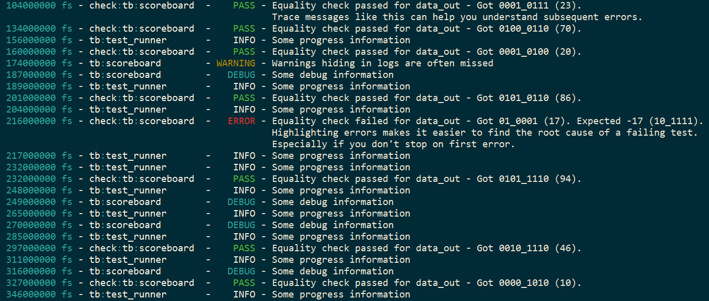

:tags: VUnit
:author: lasplund
:excerpt: 1

VUnit 3.0 Color Logging
=======================

.. NOTE:: This article was originally posted on `LinkedIn <https://www.linkedin.com/pulse/vunit-color-logging-lars-asplund>`__
   where you may find some comments on its contents.

VUnit 3.0, our next major release, is around the corner and with it
comes a number of updates and additions. This first preview post will
demonstrate color logging, one of the updates we made to our logging
framework.

Color logging is exactly what it sounds like, the addition of colors
to simplify browsing of logs. For example

What you see above is the default coloring but you can also create
your own colored log levels and colorize the log messages.

There is also another subtle but still important difference in VUnit
3.0 logging. Just like before a log message can be as simple as

.. code-block:: vhdl

  info("Some message");

and just like before you can log to a custom logger to differentiate
how logging is handled in different parts of the system.

.. code-block:: vhdl

  info(scoreboard_logger, "Some message");

The difference is not in how you make these calls but in
scoreboard_logger itself. Prior to VUnit 3.0 loggers were protected
types which comes with a number of restrictions preventing them to be
used freely. These restrictions are addressed by the upcoming
VHDL-2017 standard but rather than waiting for that standard to be
adopted by the simulator vendors, something that usually takes a few
years, VUnit 3.0 has redefined the logger type. This change removes
all such restrictions and my next preview post will show how that
simplifies logging.
