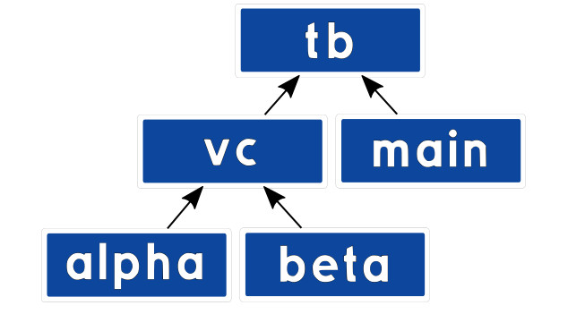
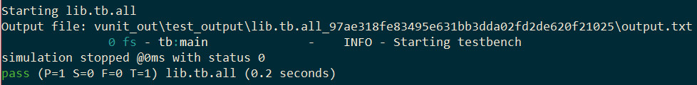
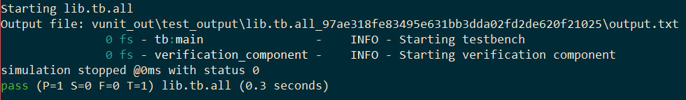
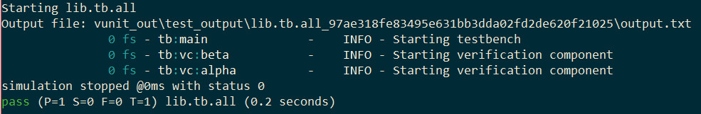
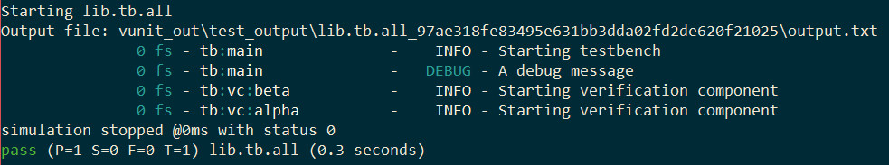

:tags: VUnit
:author: lasplund
:excerpt: 1

VUnit 3.0 - While Waiting for VHDL-2017
=======================================

.. NOTE:: This article was originally posted on `LinkedIn <https://www.linkedin.com/pulse/vunit-30-while-waiting-vhdl-2017-lars-asplund>`__
   where you may find some comments on its contents.

Background
----------

When the VUnit project started, its primary mission was to create a
framework for fully automated testing. However, it was developed
bottom-up, starting with the logging framework needed to report the
test results. The inspiration for that framework came from the popular
software frameworks at the time. They are all quite similar with
logger objects receiving the log calls, handlers deciding where the
log messages go and formatters that are responsible for the
layout. When combined and configured these objects support a great
variety of logging needs.

Back then, VHDL-93 was the standard best supported by simulators and
the logger object was best represented with a record containing its
configuration. Keeping the record in a shared variable enabled the
logger to be shared by many and its configuration to be modified when
needed. Passing a log entry to a logger was simply

.. code-block:: vhdl

  info(logger, "Hello world in VHDL-93");

VHDL-93 didn't specify what happens if you have a multi-core simulator
accessing a shared variable simultaneously from several cores. To
address this the protected type was introduced in the VHDL-2000
release. It provides means to encapsulate properties of an object and
only allows access through method interfaces. It also became the only
legal type for shared variables so VUnit loggers switched to using a
protected type.

The syntax for accessing the methods of a protected type variable is
different from standard subprograms

.. code-block:: vhdl

  logger.info("Hello world with a protected type variable");

but VUnit hides this behind standard subprogram calls to keep a
consistent API for all VHDL versions

.. code-block:: vhdl

  info(logger, "Hello world for VHDL-93 and later");

A drawback with the protected type variable is that it can't be used
as freely as other objects. For example

- It can't be passed to or returned from a function, only procedures
- It can't be used in arrays and records
- It can't be used for generics

These are restrictions making the use of protected types less flexible
and something that the upcoming VHDL-2017 standard is starting to
address. However, the adoption of new standards tend to take several
years so rather than waiting for such simulator support VUnit 3.0 has
yet again changed the underlying type of loggers.

The VUnit 3.0 Approach
----------------------

In VUnit 3.0 the logger type doesn't contain the logger
configuration. Instead it's a reference to where the logger
configuration is stored. Such a reference can be a constant without
preventing us from changing the configuration being referenced and a
constant can be globally shared without having to be of a protected
type.

Changing types like this doesn't change the basic APIs. It's still

.. code-block:: vhdl

  info(logger, "Hello world in VUnit 3.0");

Maintaining old APIs and backward compatibility is important but with
this change some old APIs can be improved. For example, we can now use
functions where we had to use procedures before. The general approach
to handle API improvements in VUnit 3.0 is that we recommend the new
interfaces while keeping the more commonly used old interfaces to make
the transition smoother.

The move from protected types is not limited to the logging framework,
we've also taken the same approach for checkers in the checker
library. Again, the basic APIs are the same, some interfaces were
improved, and we kept commonly used old APIs for backward
compatibility.

The fact that we've removed protected types from some user objects
doesn't mean that we've abandoned them completely. We're still using
them under the hood in places where we need shared variable structures
and can live with the limitations.

A Code Example
--------------

As I described previously there are several restrictions that are
lifted when removing protected types but I will just focus on one area
in this post. Indirectly it will also be a short introduction to
hierarchical logging in VUnit.

The ability to have many loggers means that different verification
components and processes can be configured individually with respect
to naming, verbosity control, log files etc. One approach would be to
leave that responsibility with the verification component but a better
approach is to leave the decision making with the testbench builder as
s/he is the consumer of the logs.

Let's show some code. Here is the start of a VUnit testbench
architecture. Nothing more than a main loop logging a couple of
messages to a custom logger named after the process path name.

.. code-block:: vhdl

  architecture a of tb is
  begin
    main : process
      constant main_logger : logger_t := get_logger(main'path_name);
    begin
      test_runner_setup(runner, runner_cfg);

      info(main_logger, "Starting testbench");
      debug(main_logger, "A debug message");

      test_runner_cleanup(runner);
    end process;
  end architecture;

The resulting output is

It may look like we created a logger named `tb:main` but the colon in
`main'path_name` has the special purpose of defining a hierarchy of
loggers with parent/child relationships. So the single call to
`get_logger` will create two loggers if they don't already exist. One
logger is named `main` and is the child of the other logger named
`tb`. Note that the debug message isn't visible. By default the `log
level` is set not to include such details.

Now let's create a dummy verification component. It will just take a
logger as a generic (not possible prior to VUnit 3.0) and then do some
logging on that logger. Here is the entity declaration.

.. code-block:: vhdl

  entity verification_component is
    generic (logger : logger_t := verification_component_logger);
  end entity;

If this component is instantiated without assigning the `logger` generic
it will use `verification_component_logger` instead. This is a logger
defined by the verification component itself and placed in an
associated package.

To make the log more readable and the example more interesting I'm
going to instantiate two verification components in my testbench and
provide them with their own loggers.

.. code-block:: vhdl

  vc: block is
    constant vc_logger : logger_t := get_logger(vc'path_name);
    constant alpha_logger : logger_t := get_logger("alpha", vc_logger);
    constant beta_logger : logger_t := get_logger("beta", vc_logger);
  begin
    alpha : entity work.verification_component
      generic map (logger => alpha_logger);

    beta : entity work.verification_component
      generic map (logger => beta_logger);
  end block;

What I've done here is to collect all my verification components in a
separate block labelled `vc`. `vc` has its own `vc_logger` based on the path
name just like I did for `main_logger`. The loggers for the `alpha` and
`beta` verification components are created in a different way. Rather
than providing a complete hierarchical name to `get_logger` I just
provide a simple name and the parent logger.

My log output will now look like this

Now that we have our hierarchy of loggers we can start controlling
it. First I'm going to make that hidden debug message in the `main`
process visible by changing the visibility settings. I'm just changing
the settings for `main_logger` and only for the display handler. What's
being logged on file is handled separately by the file handler.

.. code-block:: vhdl

  main : process
    constant main_logger : logger_t := get_logger(main'path_name);
  begin
    test_runner_setup(runner, runner_cfg);

    show(main_logger, display_handler, debug);

    info(main_logger, "Starting testbench");
    debug(main_logger, "A debug message");

    test_runner_cleanup(runner);
  end process;

The result is

I can also control the loggers for `alpha` and `beta` individually but
it's also possible to address them collectively by controlling a
shared ancestor in the hierarchy. Let's add a configuration process
to `vc`.

.. code-block:: vhdl

  vc: block is
    constant vc_logger : logger_t := get_logger(vc'path_name);
    constant alpha_logger : logger_t := get_logger("alpha", vc_logger);
    constant beta_logger : logger_t := get_logger("beta", vc_logger);
  begin
    config: process is
    begin
      show(vc_logger, display_handler, (debug, trace));
      wait;
    end process;

    alpha : entity work.verification_component
      generic map (logger => alpha_logger);

    beta : entity work.verification_component
      generic map (logger => beta_logger);
  end block;

The visibility setting applied to `vc_logger` will also be inherited and
applied to all its descendants, in this case `alpha` and `beta`.

.. figure:: img/log5.jpg
   :align: center

That's all for now. Hopefully you've learned something new about
hierarchical logging and the possibilities that open up when removing
protected types from user objects.

Next VUnit 3.0 Preview
----------------------

The next preview post will be about designing testbenches that need to
control multiple DUT interfaces at the same time. The difference
between such a testbench and one acting on a single interface boils
down to more advanced communication. That is, how we transfer
information to/from verification components and how we synchronize
their actions when they work concurrently. There are many ways to do
this but what's needed to handle the various use cases is basically
an emailing service in VHDL. Computer science calls it message passing
but the point is that emailing is something we all know. It only takes
us a few minutes to figure out a new email client so a message passing
implementation in VHDL shouldn't be more complicated than that. VUnit
has provided message passing support for several years but with the
latest update we have a one-to-one mapping between doing VUnit message
passing and managing an email thread. The next post will demonstrate
this and to make the emailing analogy very clear I will also interact
with my simulation using real emails.
