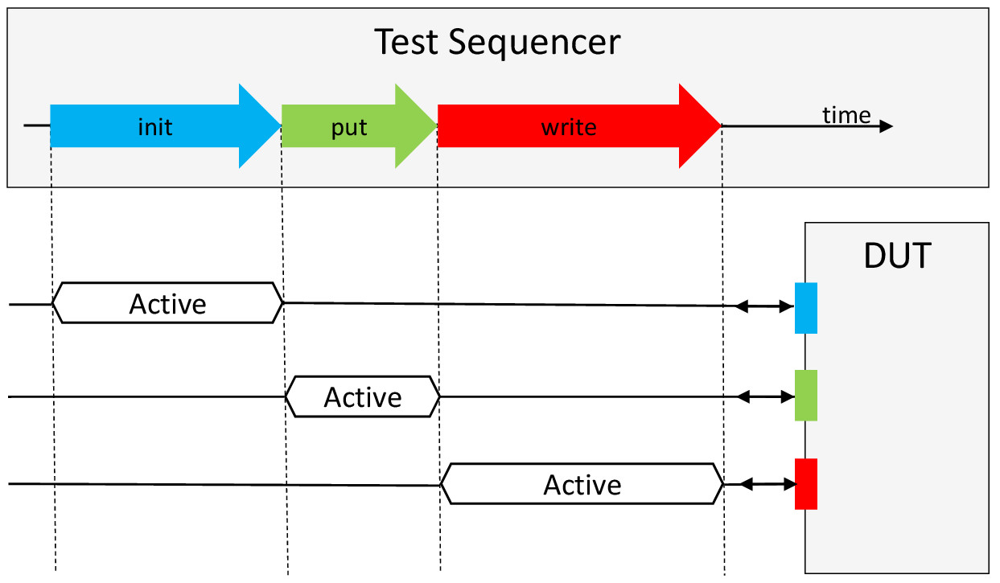
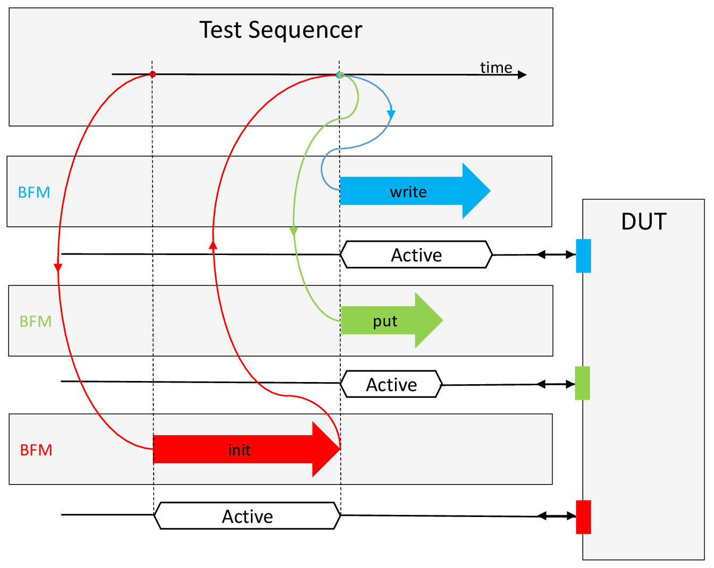
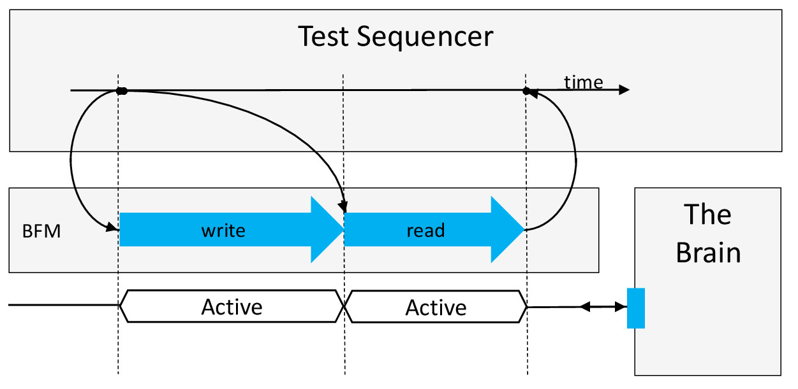

:tags: VUnit
:author: lasplund
:excerpt: 1

VUnit BFMs - as Simple as Emailing
==================================

.. NOTE:: This article was originally posted on `LinkedIn <https://www.linkedin.com/pulse/vunit-bfms-simple-emailing-lars-asplund>`__
   where you may find some comments on its contents.

VUnit 3.0, our next major release, is around the corner and with it
comes a number of updates and additions. One area which we have
improved is our support for creating advanced bus functional models
(BFMs). This includes an update of our communication library,
additional support functionality and also a number of complete
BFMs. This post will focus on the communication library, how it's used
to build advanced BFMs, and how we made it as simple as emailing. To
emphasize the email analogy I will conclude the post with a
demonstration where I use real emails to communicate with a
simulation.

Advanced vs Basic BFMs
----------------------

A basic BFM is based on procedure calls which look something like this

.. code-block:: vhdl

  write(a, number, of, bus, interface, signals, address, data);

The write procedure takes an address and a data word and then performs
the pin wiggling needed on the bus interface to complete the write
transaction. The basic BFM provides abstraction by hiding how the pin
wiggling is done and it makes the test sequencer very readable as
depicted below. First the device under test (DUT) is initialized using
the blue interface, then some data is put on the green port, then
there is a write access on the red bus interface. Crisp and clear as a
recipe.

However, looking at a real recipe we can see an important difference

1. Preheat the oven to 325F.
2. Split vanilla bean in half and scrape out the pulp.
3. While the oven is preheating, place the cream, vanilla bean and its
   pulp into a saucepan set over medium-high heat and bring to a
   boil.
4. ...

The recipe is sequential in nature but actually describes concurrent
activities. You're expected to do things **while** the oven is
preheating. This type of concurrency is something that the basic BFM
approach cannot describe.

While it makes sense to initialize the example DUT first you should
also verify what happens when the red and green interfaces are used in
parallel. The advanced BFM approach will let you do that and just like
the recipe solves the problem by having several actors (you and the
oven) the advanced approach makes use of several BFM components, one
for each interface. These components run in parallel and perform the
pin wiggling on command from the test sequencer which remains the
recipe providing overview and readability.

.. code-block:: vhdl

  init(net, configuration); -- I will explain net later
  put(net, value);
  write(net, address, data);

Now that the pin wiggling has moved to the BFM components these
procedures just initiate and optionally await the completion of that
work as shown in the figure below. Procedure calls that only initiate
BFM work will return immediately without consuming any simulation
time. This allows the concurrent execution of the `put` and `write`
transactions. Procedures like `init`, which await completion, will be
blocking and consume simulation time.

Creating an advanced BFM component from basic BFM procedures is
straightforward. The BFM component is basically just an if statement
selecting what basic BFM procedure to run based on the type of command
it receives, read or write for example. The challenging part, and the
key to make the advanced BFM approach tractable, is the communication
system connecting the test sequencer procedure calls with the BFM
components.

No Need to Reinvent the Wheel
-----------------------------

Fortunately we're not the first to deal with communication in
concurrent systems and computer science already has a mature solution
for this - the message passing paradigm. Message passing is available
in numerous programming languages so there is no lack of good examples
to be inspired by. The real challenge is to create something equally
user friendly in VHDL. So how do we measure user friendliness? For me,
the reference has been email clients. The message passing we're
talking about is very similar to basic emailing functionality and
considering that it takes a minute or two to figure out the basics of
a new email client I think that's the interface experience to strive
for.

BFM Interaction is Just Like Emailing
-------------------------------------

Let's look at some code and compare the sequence of events with those
in an email thread. In this example my test sequencer is communicating
with a BFM connected to a bus of a pure memory device. For reasons
that will appear later I'm calling this device *The Brain*.

Creating an Email Account
-------------------------

First of all, to receive an email you need to sign up for an email
account to get an email address. Same thing in message passing but we
talk about *actors* rather than accounts. Anyway, you can think of the
`brain` constant below as an email address. The test sequencer is
really communicating with the BFM but that's just a technical detail
which I've excluded from the naming.

.. code-block:: vhdl

  constant brain : actor_t := new_actor("The Brain");

The test sequencer may have direct access to the brain "email address"
but it can also figure it out.

.. code-block:: vhdl

  brain := find("The Brain");

Just like searching the contacts list in your email client.

Sending an Email
----------------

Now that the basics are covered we can start communicating. This is
how you send a message to the brain BFM instructing it to start a
write transaction.

.. code-block:: vhdl

  write_msg := new_msg(brain_write_msg);
  push_integer(write_msg, address);
  push_std_ulogic_vector(write_msg, data);
  send(net, brain, write_msg);

Just as you click the new email button in your email client you start
by creating a new empty message in VUnit.

An email has an optional subject and so do VUnit messages but we call
it a message type and it's an optional parameter to `new_msg`. It would
be possible to use a string like "write" for the subject but that can
cause a problem if you have several BFMs supporting write transactions
and use the `publisher/subscriber pattern
<https://en.wikipedia.org/wiki/Publish%E2%80%93subscribe_pattern>`__. I
will not cover that
pattern in this post but it basically allow you to subscribe to
messages published by a number of publishers. The parsing of these
messages becomes much harder if messages with different content is
allowed to have the same message type. To handle this a BFM can
register its message types and get unique identifiers in return.

.. code-block:: vhdl

  constant brain_write_msg : msg_type_t := new_msg_type("write");

When writing an email you add text but you can also attach pictures,
documents and other objects of **different** types. Same thing with my
`address` and `data` which are of different types. The reason for *pushing*
things into my message is that I'm using the message as a queue. The
first object pushed on the sender side is the first one popped on the
receiver side.

Finally I add the email address (`brain`) and click the send button to
send the email (`write_msg`) over the Inter(`net`).

What I shown so far are details not really seen by the test
sequencer. Instead the BFM would wrap this into a procedure. These are
the type of transaction calls you'll end up having in the test
sequencer.

.. code-block:: vhdl

  brain_write(net, address, data);

Compared to a basic BFM procedure there is only one interface signal,
`net`, which means less typing and no changes if the physical DUT
interface is changed.

Receiving an Email
------------------

The BFM receiving the test sequencer messages would have a process
with a body starting like this.

.. code-block:: vhdl

  begin
    receive(net, brain, command_msg);
    msg_type := message_type(command_msg);

    if msg_type = brain_write_msg then
      address := pop_integer(command_msg);
      data := pop_std_ulogic_vector(command_msg);
      write(a, number, of, bus, interface, signals, address, data);

Do you pick up the phone right away at the sound of a notification? If
so, you're like this BFM blocking on the `receive` procedure until a
message arrives to the `brain` account (the BFM can have many
accounts). Based on the message type and the message contents the BFM
takes suitable actions much like you would when receiving an
email. Note that this is the place to reuse your basic BFM procedure
presented earlier in this post.

Replying to an Email
--------------------

Replying to an email is just like writing a new email. The only
difference is that you start from the incoming email, thereby creating
a reference to it. Same thing with VUnit message passing. Below is the
continuation of the if statement above showing how the BFM replies to
a read command.

.. code-block:: vhdl

    elsif msg_type = brain_read_msg then
      address := pop_integer(command_msg);
      read(a, number, of, bus, interface, signals, address, data);
      reply_msg := new_msg;
      push_std_ulogic_vector(reply_msg, data);
      reply(net, command_msg, reply_msg);
    end if;
  end process;

Receiving an Email Reply
------------------------

Even if you react to every email notification you receive you may
choose to leave most messages for later and just read the important
ones, the emails you've been waiting for. In the following example I
do just that. First I initiate a read transaction and then I await the
reply of *that* message and ignore everything else. Messages ignored are
not deleted but remain in the inbox until you are ready to read them.

.. code-block:: vhdl

  -- Initiate a read transaction

  read_msg := new_msg(brain_read_msg);
  push_integer(read_msg, address);
  send(net, brain, read_msg);

  -- Wait for the reply to the read_msg

  receive_reply(net, read_msg, reply_msg);
  data := pop_std_ulogic_vector(reply_msg);

Again, these are details that the test sequencer doesn't have to
see. The first three lines can be encapsulated in a non-blocking read
procedure `brain_read` that lets you do other things while waiting for
the data to be returned. The last two lines can be encapsulated in a
procedure get that gets the actual data. The link between the two
procedures is `read_msg` but that name also leaks implementation
details so I'm calling it `future` instead. `brain_read` returns a
promise of future data and `get` retrieves that data and may block if
the data is yet to be received.

.. code-block:: vhdl

  brain_read(net, address, future);
  get(net, future, data);

Sometimes you just need a blocking read so a procedure bundling these
two should also be provided.

.. code-block:: vhdl

  brain_read(net, address, data);

The difference between the two `brain_read` procedures is the type of
the last parameter.

Can It Be Made Simpler?
-----------------------

    *Everything should be made as simple as possible, but no simpler.*

As you can see there is almost a 1-to-1 mapping between VUnit API
interactions and the GUI interactions in an email client. Is this as
simple as can be? If emailing is the ultimate form of simple
communication it would be, but it's not.

You may have noticed that I never created an actor for the test
sequencer so all messages to the brain have been anonymous. Allowing
such messages means one less thing to be concerned about but it's not
part of normal emailing. You can make it more like emailing by signing
your messages with a `test_sequencer` actor.

.. code-block:: vhdl

  msg := new_msg(brain_write_msg, test_sequencer);

If you do, all reply messages sent by `brain` will end up in the
`test_sequencer` inbox. If you don't `brain` will act like an email client
that has lost its network connection - it will store the reply message
in its outbox. When the test sequencer waits for the reply it will
know that the outgoing message, `read_msg` in the example below, was
anonymous and rather than waiting for a reply to appear in its inbox
it will look for the message in the `brain` outbox. No privacy but we
don't really need that.

.. code-block:: vhdl

  receive_reply(net, read_msg, reply_msg);

Sending Real Emails from within a Testbench
-------------------------------------------

To further emphasize the similarity with emailing and also show some
other aspects of VUnit message passing I'll end this post with a demo
of a VUnit testbench interacting with a real email client. The demo is
a continuation of the previous example but instead of a simulated
brain within the simulator I'm putting the brain inside my own head
and use GMail for communication.

The value of sending emails from within a simulation may be limited
but there are other more interesting situations where you need
external communication and where message passing provides a good
abstraction. But that's a story for another time.

**NOTE**: This demo recording was based on a release candidate for
VUnit 3.0 in which the `new_msg` function didn't have the message type
parameter and there was no `message_type` function for the
receiver. Instead the message type was pushed/popped to/from the
message just like any other message content. This is still possible
but not the recommended way of doing it. The newer approach provides
better debugging support as described in the `user guide
<https://vunit.github.io/com/user_guide.html>`__.

.. raw:: html

  <iframe width="560" height="315"
  src="https://www.youtube.com/embed/o5SbHjXlKbY" frameborder="0"
  allow="accelerometer; autoplay; encrypted-media; gyroscope;
  picture-in-picture" allowfullscreen></iframe>

