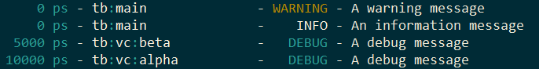

:tags: VUnit
:author: kraigher, lasplund
:image: 1
:excerpt: 1

VUnit 3.0
=========

A new year has come and it is time for a third major update of VUnit. The update contains
a number of major enhancement briefly presented in this post.

Message Passing
---------------

We have improved the ease of use of the :ref:`com <com_user_guide>`
message passing library. Message creation and parsing is now very simple using
push/pop of any standard data type together with message types.

A sending process pushes data into a message and sends it to the receiver, a
bus functional model (BFM) in this example.

.. code-block:: vhdl

  msg := new_msg(write_msg);
  push_integer(msg, address);
  push_std_ulogic_vector(msg, data);
  send(net, bfm, msg);

The message passing details would typically be wrapped into a procedure to provide a
more user friendly interface for the BFM

.. code-block:: vhdl

  write(net, address, data);

Message types are registered with `com` to get a system unique identifier.

.. code-block:: vhdl

  constant write_msg : msg_type_t := new_msg_type("write");

The type makes it easy for the receiver to handle incoming messages correctly.

.. code-block:: vhdl

  receive(net, bfm, msg);
  msg_type := message_type(msg);

  if msg_type = write_msg then
    address := pop_integer(msg);
    data := pop_std_ulogic_vector(msg);
    perform_pin_wiggling_on_bus_interface(address, data);
  elsif msg_type = read_msg then
    ...

We have also added better debug capabilities. It's possible to inspect the state of the
message passing system and trace messages can be enabled to see the dynamic behavior.

.. code-block:: console

      0 ps - vunit_lib:com -   TRACE - [2:- test sequencer -> memory BFM (read)] => memory BFM inbox
  10000 ps - vunit_lib:com -   TRACE - memory BFM inbox => [2:- test sequencer -> memory BFM (read)]
  20000 ps - memory BFM    -   DEBUG - Reading x"21" from address x"80"
  20000 ps - vunit_lib:com -   TRACE - [3:2 memory BFM -> test sequencer (read reply)] => test sequencer inbox
  30000 ps - vunit_lib:com -   TRACE - test sequencer inbox => [3:2 memory BFM -> test sequencer (read reply)]

For more information see the :ref:`com user guide <com_user_guide>`.

Verification Components
-----------------------

In VUnit 3.0 we have a *beta* version of a :ref:`verification
component <vc_user_guide>` library. Using the improved ``com`` message
passing it is very easy to create advanced verification components and
we hope to get many pull requests from users for other bus types in
the future. We've already seen some initiatives from the VUnit community
based on the release candidates for VUnit 3.0.

We say it is *beta* since we want to keep the door open to make
breaking changes as we learn more together with our users. The AXI
models are however already used in production environments.

Out of the box we provide the following verification components:
  - AXI read/write slaves
  - Memory model
  - AXI master
  - AXI stream
  - UART RX/TX
  - (B)RAM master

For more information see the :ref:`verification component library user guide <vc_user_guide>`.

Logging
-------
VUnit 3.0 contains a number of logging framework enhancements that goes
hand in hand with the verification components. We have improved the
log source hierarchy support which allows loggers to be arranged in a tree structure.

.. figure:: img/logging_hierarchy.png
   :alt: logging hierarchy
   :align: center

The position in the hierarchy is based on the logger path or instance name or by explicitly describing parent/child
relationships between loggers. Once you have a hierarchy in place you can apply configuration settings
and read status for the full tree, a subtree or an individual logger. The example below has the logger
tree depicted above and changes the visibilty for debug messages in the vc logger subtree.

.. code-block:: vhdl

  architecture a of tb is
  begin
    main : process
      constant main_logger : logger_t := get_logger(main'path_name); -- Hierarchy position based on path name
    begin
      test_runner_setup(runner, runner_cfg);

      warning(main_logger, "A warning message");
      info(main_logger, "An information message");
      debug(main_logger, "A debug message"); -- By default debug messages are not visible on the display

      show(get_logger("tb:vc"), display_handler, debug);  -- Show debug messages in vc_logger subtree (defined below)

      wait for 15 ns;
      test_runner_cleanup(runner);
    end process;

    vc : block is
      constant vc_logger    : logger_t := get_logger(vc'path_name);
      constant alpha_logger : logger_t := get_logger("alpha", vc_logger); -- Hierarchy position set as a child to vc_logger
      constant beta_logger  : logger_t := get_logger("beta", vc_logger);
    begin
      alpha : entity work.alpha_component generic map (logger => alpha_logger);
      beta : entity work.beta_component generic map (logger => beta_logger);
    end block;
  end architecture;

The result is that debug messages from the `main_logger` is hidden while debug messages from the
alpha and beta components are visible.

Note that VUnit 3.0 introduces color logging for better identification of the more important log entries.

VUnit 3.0 also introduces mocking that allows you to verify how a component interacts with the logging
framework. Below is a test case that creates an error scenario that verification component alpha is
expected to find and report.

.. code-block:: vhdl

  if run("Test that error x is triggered in scenario y") then
    mock(alpha_logger, error);

    <Code creating scenario y which is expected to trigger error x>

    check_log(alpha_logger, "An error message", error);

    unmock(alpha_logger);
  end if;

`check_log` checks the oldest log call to `alpha_logger`. The log call must be an error log
with the given message string or the test case will fail. If there are remaining logs which
haven't been checked when calling `unmock` the test case will also fail.

It's possible to call `mock` without the second parameter but that would force us to also check the
debug messages and that's typically not needed. `check_log` also has a number of other parameters to
verify other attributes of a log call, time for example. However, in many cases we don't care about the
exact time of the log so that parameter is optional.

For more information see the :ref:`logging user guide <logging_library>`.

As always, comments and feedback are welcome.

-- The VUnit development team
