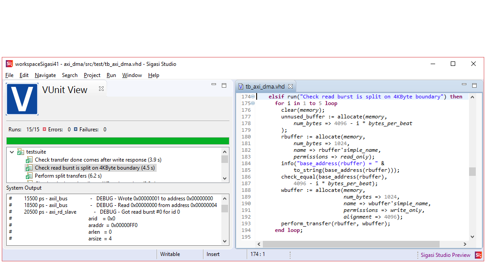
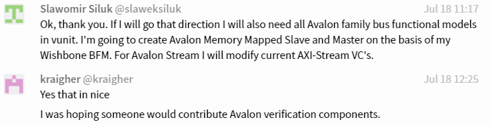

:tags: VUnit
:author: lasplund
:excerpt: 1

Sigasi Deepens Its Commitment to the VUnit Testing Framework
============================================================

.. NOTE:: This article was originally posted on `LinkedIn <https://www.linkedin.com/pulse/sigasi-deepens-its-commitment-vunit-testing-framework-lars-asplund>`__
   where you may find some comments on its contents.

Sigasi started to support the VUnit testing framework when their
Sigasi Studio IDE became VUnit-aware in the 3.6 release. That release
introduced a feature to conveniently configure the VUnit library for
your Sigasi Studio project.

With the upcoming 4.1 release Sigasi takes a leap beyond convenience
by adding values that haven't been available before. VUnit is now
integrated such that tests can be executed with a mouse click and
verification progress and results can be monitored in a dedicated
VUnit view.

VUnit-based development with a Sigasi front-end is now becoming
equivalent to how testing is managed in modern software
development. This doesn't dictate your test methodology
though. Whether your tests are based on directed, constrained random,
file-based or some other form of testing is still up to you. A good
example of this is how verification engineers with a UVM background
have started to use VUnit to fully automate their `test environments
<https://github.com/VUnit/vunit/issues/328>`__.

Sigasi Studio is not the first tool to go beyond convenience support
and start building on top of VUnit (see `Eksen
<https://repositories.lib.utexas.edu/handle/2152/63753>`__ for an
example) but it
is the first commercial tool. This follows a line of logical steps
I've seen over the years where the first wave of VUnit adopters are
individuals spread around the world (see below), the second wave are
the organizations for which these individuals are working, and the
third wave are the tool providers acting to support these
organizations.

Each wave typically has three phases. In the first phase VUnit is
evaluated and by the end of this phase some independent users will
make their findings public by publishing `blogs
<https://www.itdev.co.uk/blog/uvm-vunit-v30-test-benches-vhdl>`__ and
`tweets <https://twitter.com/t045tbr0t/status/1003743680480661505>`__ for
example. Some of them will endorse the project by giving it a star and
this is probably the best indication that the project is surviving the
evaluation phase. The VUnit star trend has been pretty consistent over
the last years but it did take a new direction at the time we
announced VUnit 3.0 which was a release focusing on `BFMs and
verification components in general
<https://www.linkedin.com/pulse/whats-new-vunit-30-lars-asplund/?lipi=urn%3Ali%3Apage%3Ad_flagship3_pulse_read%3B6paKOT7iQKmh9OusX2ZrQw%3D%3D>`__.

The second phase is when people become long-term committed to the
tool. Companies make VUnit part of their development methodology,
`often in combination with a continuous integration server
<https://indico.cern.ch/event/709454/contributions/2916288/attachments/1608356/2571823/Minutes_BI-DD_2nd_meeting.pdf>`__,
and VUnit
becomes `a requested skill
<https://de.indeed.com/rc/clk?jk=4c56b8bab0d48092&fccid=6ecef7e262586259&vjs=3>`__
when looking for new employees. Universities
include VUnit in their `courses <https://ci.csn.khai.edu/courses>`__
and their `textbooks
<https://mitpress.mit.edu/books/effective-coding-vhdl>`__. Tool
providers
starts adding convenience support like Sigasi did with the VUnit
awareness in Sigasi Studio 3.6 or they bundle VUnit with their
tools. Bundling is not something we've pursued due to our continuous
delivery approach with releases every other week on average. A bundled
version will always be outdated so the Sigasi approach of being aware
of the VUnit already installed is preferred.

The second phase is also when users start thinking about how VUnit can
be tailored for their specific needs and as a result there are a lot
of `questions in various forums
<https://stackoverflow.com/questions/42980036/how-to-combine-multiple-vunit-run-py-files-into-a-single-vunit-run>`__
and in our `chat <https://gitter.im/VUnit/vunit>`__. A lot of activities in
the user forum and in the `feature request area
<https://github.com/VUnit/vunit/issues?utf8=%E2%9C%93&q=>`__ is a sign
that there are people in the second phase.

Having a large and active user community is essential to a project
like VUnit. It's the open many-to-many discussions that make sure that
the tool stays relevant. Close to 150 users have been active on our
website in this way:

The first two phases are basically a free lunch. People use what's
freely available or request that missing features are added. The third
phase is when the users start investing time and money to contribute
to the VUnit ecosystem. It can be anything from `fixing documentation
typos <https://github.com/VUnit/vunit/pull/142>`__ to `contributing a
BFM <https://github.com/VUnit/vunit/pull/312>`__ or something
independent like building
tools on top of VUnit in the way Sigasi is doing now. A lot of
activity in the `pull request area
<https://github.com/VUnit/vunit/pulls?utf8=%E2%9C%93&q=>`__ is a sign
that the project has entered this phase.

Having many users actively and publicly involved in maintaining and
expanding the code base is something we highly encourage as it
improves the pace and continuity of the project. So far 27 users have
`contributed <https://github.com/VUnit/vunit/graphs/contributors>`__
to the code.

That's all for now. If you're interested in a test drive of Sigasi
Studio 4.1 I recommend that you have a look at the early preview which
can be downloaded from the `Sigasi preview channel
<http://insights.sigasi.com/tech/preview.html>`__. Make sure that you
have the `latest VUnit version installed
<http://vunit.github.io/installing.html>`__. Currently only VHDL is
supported but SystemVerilog support is also planned. This is a release
in the making so feedback is appreciated. Contact Sigasi directly or
use the `VUnit chat <https://gitter.im/VUnit/vunit>`__ (Sigasi is
monitoring that as well).

