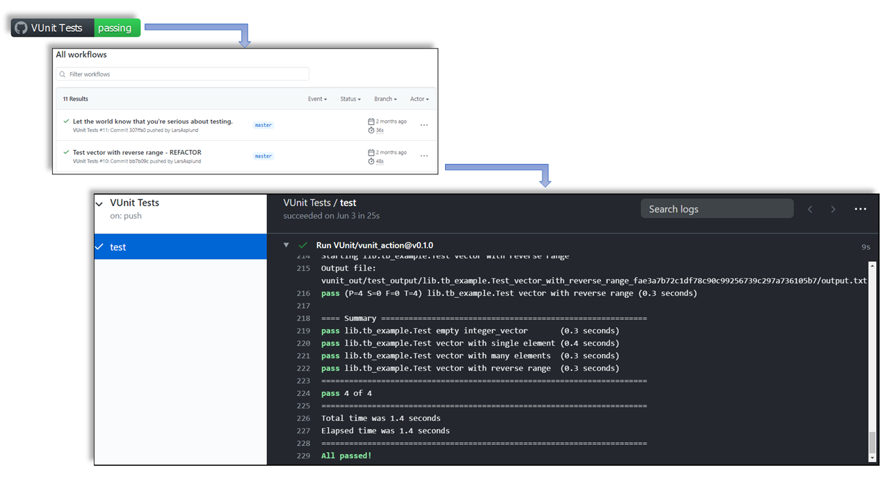

:tags: VUnit
:author: lasplund
:excerpt: 1

Continuous Integration With VUnit Action in 10 Lines of Code
============================================================

The other week, `semiengineering.com <https://semiengineering.com>`__ published an
`article <https://semiengineering.com/open-source-verification>`__ on open-source verification.
It had one, rather obvious, conclusion.

 *Verification is required to answer the question, 'Do you trust the piece of hardware you received?'*

 -- Neil Hand, director of marketing for design verification technology at Mentor, a Siemens Business

Despite being obvious, IP providers often make it hard to gain that trust.

 *When you buy IP, you usually get a very simple verification environment. This enables you to run a
 few demo tests or check configurations. You do not usually get the entire verification environment.*

 -- Olivera Stojanovic, senior verification manager for Vtool

This is not unique to commercial IPs. Our `study <https://larsasplund.github.io/github-facts/index.html>`__
of VHDL projects on GitHub shows that less than half of all projects provide tests at all, and the trend
is declining (see Figure 1).

.. figure:: img/repositories_providing_tests.png
   :align: center

   Figure 1. Repositories providing tests.

So, what are the reasons for not providing tests with the IPs?

 *With complex IPs, they don’t want to provide you with the verification environment, which is too
 complicated and potentially may provide insights that they might want to keep from you.*

 -- Olivera Stojanovic, senior verification manager for Vtool

Keeping secrets is not a reason for not providing tests with public projects on GitHub, as everything is
open/public. However, it can be complex to create a user-friendly online verification environment that
clearly shows what has been tested and the status of those tests. Thanks to
`VUnit Action <https://github.com/marketplace/actions/vunit-action>`__ this is now much simpler, as it
provides a continuous integration flow with just 10 lines of code.

If you're not familiar with VUnit, the following reading will set you up for the VUnit Action described
in the next section.

1. `Installing VUnit in 1 minute <https://www.linkedin.com/pulse/vunit-best-value-initial-effort-lars-asplund>`__
2. `Compiling your project in 1 minute <https://www.linkedin.com/pulse/vunit-best-value-initial-effort-part-2-lars-asplund>`__
3. `Fully automating your testbench with 5 lines of code <https://www.linkedin.com/pulse/vunit-best-value-initial-effort-part-3-lars-asplund>`__

VUnit Action
------------

GitHub’s continuous integration/continuous deployment (CI/CD) service is named
`GitHub Actions <https://github.com/features/actions>`__ (GHA). It allows to create automated workflows
for your repositories, which are defined through `YAML <https://en.wikipedia.org/wiki/YAML>`__ files.
Workflows can be triggered by any event, such as push, issue creation or publication of releases.

GHA provides virtual machines with GNU/Linux (Ubuntu), Windows or macOS. Hence, it is possible to create
a custom CI/CD workflow using bash, powershell, Python etc. However, there are also predefined workflow
tasks named Actions.  Some Actions are provided by GitHub
(see `github.com/actions <https://github.com/actions>`__), and some are published in the
`GitHub marketplace <https://github.com/marketplace?type=actions>`__. Nevertheless, any GitHub repository
can contain Actions.

`VUnit Action <https://github.com/VUnit/vunit_action>`__ is a reusable Action, built on the
`GHDL simulator <https://github.com/ghdl/ghdl>`__, and available in the marketplace
(`github.com/marketplace/actions/vunit-action <https://github.com/marketplace/actions/vunit-action>`__).
It helps you build a workflow for running your HDL testbenches, and then present the results.

To use VUnit Action for your project, you need to create a `YAML <https://en.wikipedia.org/wiki/YAML>`__ file
(`some_name.yml`) and place that in a directory named `.github\\workflows` (located directly under your project root),
in the default branch of your repository. The YAML file should contain, at least, the following piece of code.

.. code-block:: yaml

    name: VUnit Tests
    on:
      push:
      pull_request:
    jobs:
      test:
        runs-on: ubuntu-latest
        steps:
          - uses: actions/checkout@v2
          - uses: VUnit/vunit_action@v0.1.0

Whenever someone pushes code to the project or makes a pull request, this workflow is triggered. First, the code
is checked out using the `checkout action <https://github.com/marketplace/actions/checkout>`__. Then, the VUnit
Action is triggered, to run the `run.py` script located in the root of your repository. If the VUnit run script is
located elsewhere, you specify it in the YAML file:

.. code-block:: yaml

    - uses: VUnit/vunit_action@v0.1.0
      with:
        run_file: path/to/vunit_run_script.py

To build trust with the user community by clearly showing that you have tests up and running, we recommend that
you add a badge/shield to the `README.md` of your project. It will show the latest status of you tests:

.. code-block::

    

Clicking the badge/shield will take you to a list of workflow runs, and then further to the results of those runs:

   Figure 2. Presenting Test Results.

The simple solution presented here will get you started and you can read more about the details in our
`documentation <http://vunit.github.io/ci/script.html#github-actions>`__. Once you have that working there are a
number of extra steps you can take and that will be the topic of the next post on continuous integration.
