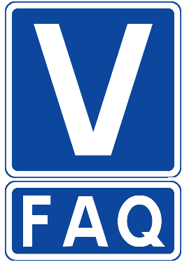

:tags: VUnit
:author: lasplund
:excerpt: 1

FAQ What is VUnit's Relation to Other Verification Frameworks?
==============================================================

Fairly often I get questions about VUnit repeated several times. Typically in our
`Gitter chat <https://gitter.im/VUnit/vunit>`_ or some other online
forum. Most question are of a technical nature and the answer is to be found on our website but sometimes there is
a bit more to it. The answer relates to how we view open source, verification in general, our history and our plans
for the future. These things are only partly addressed in our documentation so I'm planning to give it some more
attention going forward.

The FAQ I'm addressing today is what our relation to OSVVM is. Why is it included in our repo? Why are other similar
projects like UVVM not included? Why include OSVVM features that overlaps with those VUnit already provides?

The reason for having OSVVM included in the first place can be found in the history of the VUnit project. When VUnit
was publicly released in 2014 it had been in the workings for some time and various features had been developed and
explored. While most work was targeting the pieces we missed in the open source ecosystem for verification we also
produced things like document generation from code, VUnit integration with Emacs, and also functionality for
constrained random verification. However, to stay focused we decided to:

1. Exclude areas of functionality where we do not provide significant benefits over existing offerings.
   Instead we should make sure that we are compatible with those projects and contribute improvements if needed.
2. Exclude features not at the core of verification. Instead we should provide open interfaces allowing others to
   extend VUnit in various directions.

Using OSVVM for constrained random instead of our own functionality was an immediate consequence of this strategy and
over the years we've had several commercial, open source, and research initiatives taking advantage of the open
interface strategy to build on top of VUnit. Today we have that
`VUnit mode <https://embed-me.com/vunit-mode-emacs-vunit>`_ for Emacs but also integrations with
`Eclipse <https://insights.sigasi.com/tags/vunit>`_,
`VS Code <https://terostechnology.github.io/terosHDLdoc/index.html>`_,
`Atom <https://atom.io/packages/test-runner-vunit>`_ and more.

At the time the decision was made to go with OSVVM, the tool was distributed as a download for registered users.
Strongly believing that open source projects should be hosted on one of the popular Git-based platforms we decided
to include a copy of OSVVM in the VUnit repository as a convenience for our users. Later on OSVVM was moved to GitHub
and we made it a Git submodule in The VUnit project. For those not very familiar with Git a submodule is basically a
way to include another Git repository by having a reference to its original location rather than making a copy.

With OSVVM available on GitHub there are less reasons to have it included but along the way we also added our own
`random_pkg <https://github.com/VUnit/vunit/blob/master/vunit/vhdl/random/src/random_pkg.vhd>`_ for randomization
functions specific to VUnit-provided data types. This functionality depends on lower-level functions in OSVVM so we
decided to keep it included. It's a weak dependency though since ``random_okg`` is an
`optional add-on <https://vunit.github.io/py/vunit.html?highlight=random#vunit.ui.VUnit.add_random>`_

As some of you noted there is a feature overlap between VUnit and OSVVM. This was not the case in 2014 but OSVVM has
broaden its scope over the years. As an advocate for VUnit I obviously prefer native functionality but cherry-picking
pieces from OSVVM in an attempt to steer users into what I prefer is not time well spent. A healthy community with
engaged and open discussions will foster rational users making their own informed decisions. Without budget limitations
the rational user will do their own cherry-picking from many tools.

Our decision to include OSVVM does not in any way prevent users preferring other constrained random solutions.
Adding OSVVM to a VUnit project is slightly simplified with the
`add_osvvm <https://vunit.github.io/py/vunit.html?highlight=add_osvvm#vunit.ui.VUnit.add_osvvm>`_ method while other
solutions need to be compiled explicitly from source. However, that is still a one-liner should you prefer a solution
like the one from UVVM:

.. code-block:: python

    from vunit import VUnit

    prj = VUnit.from_argv()

    # OSVVM is a VUnit add-on and has a convenience method used to compile it into the project
    prj.add_osvvm()

    # UVVM must be compiled from source
    prj.add_library("uvvm_util").add_source_files("path" / "to" / "uvvm_util" / "src" / "*.vhd")

Going forward we will open up and improve more interfaces to simplify VUnit integration with other tools.
For examples, `#776 <https://github.com/VUnit/vunit/pull/776>`_ is a draft for an interface that allows
users to route log entries in VUnit's logging framework to another logging framework, for example those
provided by OSVVM or UVVM. In a mixed-framework environment different logging systems can produce output
with different styles and this interface would enable users to have a consistent style as dictated by
the non-VUnit framework. For a consistent VUnit logging style OSVVM and UVVM would have to provide a
similar interface.

There is also `#785 <https://github.com/VUnit/vunit/pull/785>`_ which extends the VUnit support for using
VHDL configurations as a way to define test cases in a test suite. This is the style traditionally used by
OSVVM.

In summary, VUnit has a special relation with the OSVVM framework but we embrace integration with all
frameworks out there. This post discussed OSVVM and UVVM specifically but VUnit is also used with the
other popular VHDL, SystemVerilog and Python frameworks.
