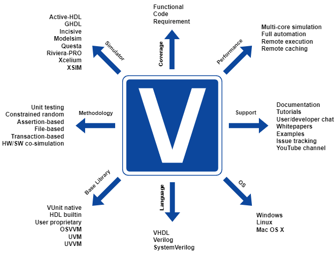
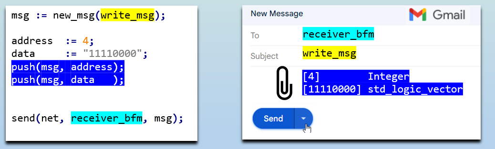
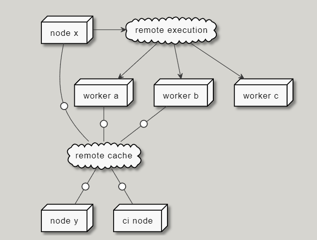
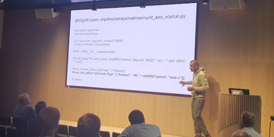
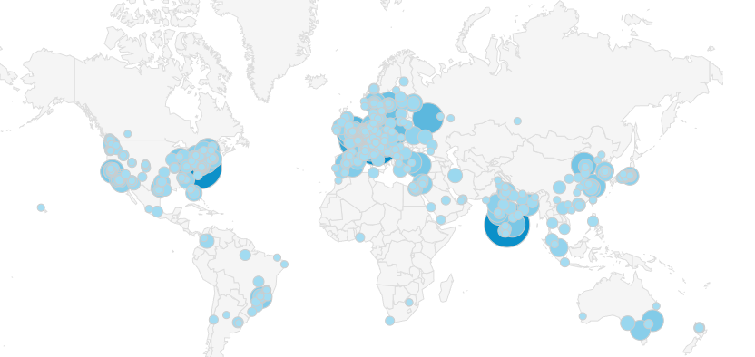
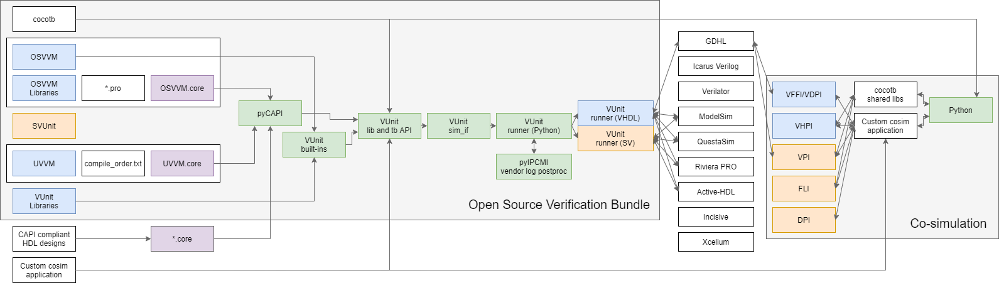

:tags: VUnit
:author: lasplund
:excerpt: 1

VUnit User Conference
=====================

Last week I visited FPGA World in Stockholm after a few years of absence. This is a place where the founding team
of VUnit has presented VUnit and performed tutorials in the past. This year was different though.
This year the VUnit users took the command and I had the pleasure of simply sitting down and watch their work.
I felt that this was a step in the right direction. Over the last few years the amount of content (blogs, videos,
tutorial, papers, etc) created by others exceeds what I'm able to produce and it is time for this to be reflected
at conferences as well. It will provide a more diverse set of perspectives and it will take the audience to places
which I have never explored.

Mikael Wetterholm: Automated HDL Verification with VUnit
--------------------------------------------------------

The first VUnit presenter this year was `Mikael Wetterholm <https://github.com/mikaelwet>`_, student at
`AGSTU <https://yh.agstu.se>`_, who gave an introduction to VUnit. I was very pleased to see how far he had come just
by studying our online material. Not only did he cover the basics but he had also fully understood more advanced topics
such as verification component design based on our `message passing mechanism <https://vunit.github.io/com/user_guide.html>`_.
I particularly liked how he had found novel use cases for the mechanism and the clarity with which he could explain concepts:

Oskar Solsjö: VUnit + Bazel
---------------------------

The second presenter was `Oskar Solsjö <https://github.com/solsjo>`_, consultant from `Sylog <https://sylogsystems.se>`_ currently
working at `Qualcomm <https://www.arriver.com>`_ with their camera-based automotive autonomy technology. Oskar showed how the build
system `Bazel <https://bazel.build>`_ can cut build times for large and complex systems from days to minutes and the work he done
to integrate VUnit with Bazel. He showed how Bazel's remote caches and remote execution can make the scale of a project work to your
advantage rather than being a hindrance. Never build or simulate something already done by others and have your long simulations distributed
over many machines to improve performance.

Unai Martinez-Corral: Bridging HW and SW verification with VUnit Co-Simulation
------------------------------------------------------------------------------

The final presenter on the VUnit track was `Unai Martinez-Corral <https://github.com/umarcor>`_ from `Antmicro <https://antmicro.com>`_ and the
`University of the Basque Country <https://www.ehu.eus/en/en-home>`_ in Spain. Unai came to VUnit through his research on HW and SW co-simulation
a couple of years ago and since then he has been a very valuable contributor to the community. Co-simulation is a broad topic but let me just
provide one example of what can be done. VUnit always had a commonly used way to integrate with SW. The
`pre_config and post_check functions <https://vunit.github.io/py/ui.html#pre-and-post-hooks>`_ allow us to run Python both before and after
a test. These functions can for example generate input stimuli to the test and verify its outputs. They can do the work themselves or call
functions in Matlab, Go, Rust, C, or some other language. What co-simulation brings is also a way to call these functions from within the
VHDL simulation. Why spend time implementing a (complex) function in VHDL if it is already available in any of the other languages?

VUnit on the Floor
------------------

One of the greatest benefits with conferences like this is of course to meet with the VUnit users between the presentations.
There are always some new faces and old acquaintances but there is also a trend which is becoming more and more prominent. The new faces
are, unlike Mikael Wetterholm, developers who didn't pick up VUnit online but were introduced by more senior users that over the years
have moved on to new companies where they introduced the framework. I saw this when visiting FPGA Forum in Norway the week before and FPGA World
made it even more evident. Considering that VUnit was founded in Sweden it is not strange to see that there are hotspots here in the Nordic countries
but it also raises the question if there are other hotspots. Analyzing the traffic into our homepage can give some insights into this. It's a bit
hard to see on the map below but the hottest spot is actually Munich and Germany in general.

Open Source EDA
---------------

Historically there has been a tendency among EDA vendors to describe open source tools as generally inadequate and of low quality. Something
that can be used in academia but not for serious professional projects. In March last year I wrote an
`article <https://www.linkedin.com/pulse/open-source-tools-mission-critical-hardware-lars-asplund>`_ providing undeniable proof that this
is no longer the case and just maybe we're starting to see some changes (I'm not taking credit for this). Sure, at every conference there
will be sales representatives presenting UVM and the high-end simulators needed to run UVM as the only serious alternative to verification. That's
their job. However, at the same time there are other vendor representatives presenting a more nuanced view of reality.

For example, this year Siemens EDA had a presentation pointing out problems with UVM causing users to look into other solutions. The presentation
then focused on open source cocotb as a potential solution. Hang on, isn't UVM also open source? Yes, it is but the vendor simulators needed to
run UVM comes with a price tag out of reach for many companies while cocotb supports a wider range of simulators, including free alternatives.
Not only is Siemens EDA making a presentation on cocotb. They also support an open source project called `pyuvm <https://github.com/pyuvm/pyuvm>`_
which provides a Python implementation of UVM running through cocotb. It's still UVM though which has, as the presentation noted, a
"high learning time/benefit ratio". However, Siemens is a big company and other parts are going in a different direction.
For example, Siemens in Erlangen is looking for people to work with
`"Simulation und Verifikation mit OSVVM mit Mentor QuestaSim und VUnit" <https://www.ferchau.com/de/en/applicants/jobs/328054/fpga-sw-entwickler-fur-unseren-kunden-siemens>`_.

What we see now, I hope, is that the EDA vendors are starting to recognize the open source ecosystem and that there is no one solution that fits all.
Instead there are multiple solutions that we need to acknowledge and strive to make compatible with each other if we want to serve our users.
`Unai <https://github.com/umarcor>`_, the final presenter in the VUnit track, is very active in many of these open source solutions.
Just click on his name to see his truly impressive track record on GitHub. Part of his work has been focusing on how we can make everything work
together rather than having a set of isolated islands. That work led to the `Open Source Verification Bundle <https://github.com/umarcor/osvb>`_
presented in the figure below.

I think this figure clearly shows that we're well beyond the idea of a single provider and that the key for providers
going forward is to make sure they fit into the ecosystem. If they do, they can be part of a setup like the one in the figure or in a setup with
another selection of tools. If they don't, I think they will be left behind.