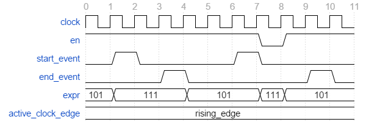
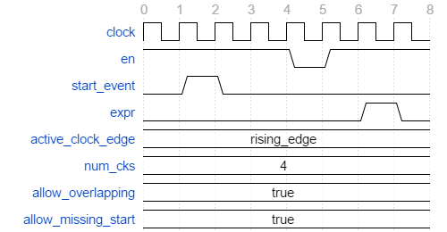
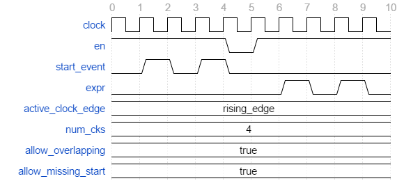
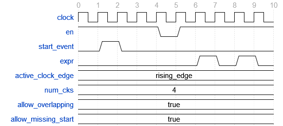
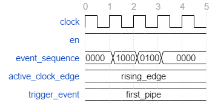
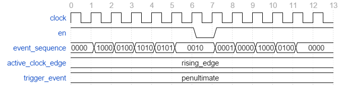

.. _check_library:

Check Library
=============

Introduction
------------

The check library is an assertion library for VHDL providing the more
commonly used assertions as a number of check procedures and functions.

Architecture
------------

The check subprograms are conditional log messages. If
the condition represents a failing check then an error message is issued
using the VUnit :doc:`log package <../logging/user_guide>`.

Every check you do is handled by a checker. There is a default checker
that is used when none is specified but you can also create multiple
custom checkers. For example

.. code-block:: vhdl

    check(re = '1', "Expected active read enable at this point");

will use the default checker while

.. code-block:: vhdl

    check(my_checker, re = '1', "Expected active read enable at this point");

will use the custom ``my_checker``. A custom checker is just a variable or constant
initialized with the `new_checker` function.

.. code-block:: vhdl

    constant my_checker : checker_t := new_checker("my_checker");

All subprograms presented in this user guide are available for both the
default checker and custom checkers. The difference is the first
``checker`` parameter which only exists for custom checker subprograms.
To make the user guide more compact we present this as an optional
parameter using brackets. For example

.. code-block:: vhdl

    impure function check_false(
     [constant checker   : in checker_t;]
      constant expr      : in boolean;
      constant msg       : in string      := result(".");
      constant level     : in log_level_t := null_log_level;
      constant line_num  : in natural     := 0;
      constant file_name : in string      := "")
      return boolean;

The full verbose API description can always be found in
`check\_api.vhd <src/check_api.vhd>`__.

Checker Creation
----------------

Since a check is a conditional log it uses a ``logger_t`` from the
logging library described in the :doc:`logging user guide
<../logging/user_guide>` under the hood.

A ``checker_t`` is created with a logger name used for the logger
internally. Additionally there is a ``default_log_level`` parameter to
specify the log level of a failing check.

.. code-block:: vhdl

    impure function new_checker (
      constant logger_name : in string;
      constant default_log_level  : in log_level_t  := error)
      return checker_t;

Check
-----

The check library provides a basic ``check`` procedure which is similar
to the VHDL ``assert`` statement

.. code-block:: vhdl

    check(re = '1', "Expected active read enable at this point");

The first parameter is the boolean expression to check and the second parameter
is the error message issued if the expression is false. Assuming this
check fails and you haven't changed the default settings for the default checker
the error message will be something like

.. code-block:: console

    10000 ps - check -  ERROR - Expected active read enable at this point

If you wish to have another log level than the default one set by
``new_checker`` you can override this for each check call. For example

.. code-block:: vhdl

    check(re = '1', "Expected active read enable at this point", failure);

A failing check is always counted as a failing check regardless of the
level but the level affects whether or not the simulation stops as
controlled by the stop level for the internal logger. The stop level can be change
by retrieving the logger and then use the ``set_stop_level`` procedure as described
in :doc:`logging user guide <../logging/user_guide>`. For example

.. code-block:: vhdl

    set_stop_level(get_logger(my_checker), warning);

Note that when using the VUnit Python test runner the default checker
stop level is set to ``error`` when calling ``test_runner_setup``.
The reason is that the Python test runner has the ability to restart the
simulation with the next test case so that all test cases are run
despite of an error while **guaranteeing** that the error state of the
failing test case doesn't propagate into the next. If you're not using
the Python test runner the stop level is set to ``failure`` as a way
to continue on ``error`` but without this guarantee.

Logging Passing Checks
~~~~~~~~~~~~~~~~~~~~~~

The provided message in a check call is also logged when the check
passes. The typical use case is to create a debug trace to investigate
what happened before a bug occured. This feature uses the log
level ``pass`` that is not visible by default but can be enabled
for any log handler.

.. code-block:: vhdl

    show(get_logger(default_checker), display_handler, pass);

The difference between a passing check log message and a failing check log message is
the log level used. A passing check like this

.. code-block:: vhdl

    check(re = '1', "Checking that read enable is active");

will result in a log entry like this

.. code-block:: console

    1000 ps - check - PASS - Checking that read enable is active

Note that a message that reads well for both the pass and the fail cases was used.

A number of check subprograms perform several checks for every call, each of which can fail
and generate an error message. However, there will only be one pass message for such a call
to avoid confusion. For example, ``check_stable`` checks the stability of a signal for every
clock cycle in a window. If the window is 100 clock cycles there will be 100 checks for
stability but there will only be one pass message, not 100, if the signal is stable.

Message Format
~~~~~~~~~~~~~~

In the previous examples the outputs from passing and failing checks were the messages provided by
the user with the addition of a timestamp, the logger name and the log level.
If we change the log format to ``raw`` there would be no additions at all, just the user message.
However, the check subprograms may also add information to the user message before the log format
additions are applied. For example, checking a pixel value after an image processing operation can
be done like this:

.. code-block:: vhdl

    check_equal(output_pixel, reference_model(x, y), "Comparing output pixel with reference model");

Resulting in an error message like this:

.. code-block:: console

    1000 ps - check - ERROR - Comparing output pixel with reference model - Got 1111_1010 (250). Expected 249 (1111_1001).

The last part of the message provides an error context to help debugging. Such a context is only given
if that provides extra information. In the case of a failing ``check`` we know that the input boolean is
false so there is no need to provide that information. The context may also be different between pass and
error messages. For example, a pass message from ``check_equal`` looks like this:

.. code-block:: console

    1000 ps - check - PASS - Comparing output pixel with reference model - Got 1111_1010 (250).

Redundancy is avoided by excluding the expected value which is the same as the value received.

So far I've used a message that reads well in both the passing and the failing case. The check library
also provides another way of doing this using the ``result`` function. The call

.. code-block:: vhdl

    check_equal(output_pixel, reference_model(x, y), result("for output pixel"));

gives the following messages:

.. code-block:: console

    1000 ps - check - ERROR - Equality check failed for output pixel - Got 1111_1010 (250). Expected 249 (1111_1001).

and

.. code-block:: console

    1000 ps - check - PASS - Equality check passed for output pixel - Got 1111_1010 (250).

The ``result`` function prepends the provided string with the check type (equality check in this case)
and passed/failed depending on the result. The ``result`` function is also used as the default value for
check calls so

.. code-block:: vhdl

    check_equal(output_pixel, reference_model(x, y));

gives the following messages:

.. code-block:: console

    1000 ps - check - ERROR - Equality check failed - Got 1111_1010 (250). Expected 249 (1111_1001).

and

.. code-block:: console

    1000 ps - check - PASS - Equality check passed - Got 1111_1010 (250).

If you look at the default value for the user message in the check subprogram APIs you will see that the
``result`` function isn't used. This is a workaround for one of the supported simulators which exposes the
internal implementation of the ``result`` function (a magic constant prepending the user message).
You shouldn't use the magic constant yourself since that implementation may change at any time. For that reason
I'm also keeping the ``result`` function in the APIs presented in this user guide.

Check Location
~~~~~~~~~~~~~~

The ``check`` subprograms described in the previous sections have two
additional parameters, ``line_num`` and ``file_name``. These are
normally not set by the user but by the location preprocessor such that
the location of a failing check is included in the error message. The
location preprocessor is further described in the :doc:`log user
guide <../logging/user_guide>`. Preprocessor parameters are always
placed at the end of the parameter list and they have "good" default
values such that the function behaves nicely even if the preprocessor
isn't used.

.. code-block:: vhdl

    procedure check(
     [constant checker   : in checker_t;]
      constant expr      : in boolean;
      constant msg       : in string      := result(".");
      constant level     : in log_level_t := null_log_level;
      constant line_num  : in natural     := 0;
      constant file_name : in string      := "");

Acting on Failing Checks
~~~~~~~~~~~~~~~~~~~~~~~~

The ``check`` subprogram described so far doesn't reveal whether the
check passed or not. If you want that information to control the flow of
your test and your testbench is setup to continue on a failing check you
have a number of options. You can use the check functions which return
``true`` on a passing check and ``false`` when they fail.

.. code-block:: vhdl

    impure function check(
     [constant checker   : in  checker_t;]
      constant expr      : in  boolean;
      constant msg       : in  string      := result(".");
      constant level     : in  log_level_t := null_log_level;
      constant line_num  : in  natural     := 0;
      constant file_name : in  string      := "")
      return boolean;

or you can use check procedures with a boolean ``pass``
output returning the same information.

.. code-block:: vhdl

    procedure check(
     [constant checker   : in  checker_t;]
      variable pass      : out boolean;
      constant expr      : in  boolean;
      constant msg       : in  string      := result(".");
      constant level     : in  log_level_t := null_log_level;
      constant line_num  : in  natural     := 0;
      constant file_name : in  string      := "");

or you can use any of the following subprograms to get more details.

.. code-block:: vhdl

    impure function get_checker_stat[(
      constant checker : in  checker_t);]
      return checker_stat_t;

.. code-block:: vhdl

    procedure get_checker_stat (
     [constant checker : in  checker_t;]
      variable stat    : out checker_stat_t);

``checker_stat_t`` is a record containing pass/fail information.

.. code-block:: vhdl

    type checker_stat_t is record
      n_checks : natural;
      n_failed : natural;
      n_passed : natural;
    end record;

Note that a check subprogram with many internal checks may
generate several error messages if the simulation isn't stopped by an error.
Each such error will add one to ``n_checks`` and ``n_failed``. However, if
the check pass ``n_checks`` and ``n_passed`` will only be increase by one.
The reason for this is the same as for the single pass message approach, that
is to avoid mismatch between the pass statistics and the number of passing
check subprogram calls.

Managing Checker Statistics
~~~~~~~~~~~~~~~~~~~~~~~~~~~

A checker will continuously update its statistics counters as new check
subprograms are called. If you want to collect the statistics for parts
of your test you can make intermediate readouts using the
``get_checker_stat`` subprograms and then reset the counters to zero
using

.. code-block:: vhdl

    procedure reset_checker_stat [(
      constant checker : in checker_t)];

Another way of collecting statistics for different parts is to use
several separate checkers.

Variables of type ``checker_stat_t`` can be added to or subtracted from
each other using the normal ``-`` and ``+`` operators. There is also a
``to_string`` function defined to allow for logging/reporting of
statistics, for example

.. code-block:: vhdl

    info(to_string(get_checker_stat));

Check Types
-----------

In addition to the basic ``check`` subprograms the check library also
provides a number of more specialized checks. These checks can be
divided into four different types

-  Point checks
-  Relation checks
-  Sequential checks
-  Unconditional checks

These types and the checks belonging to each type are described in the
following chapters.

Point Checks
~~~~~~~~~~~~

Common to all point checks is that the condition for failure is
evaluated at a single point in time, either when the subprogram is
called as part of sequential code or synchronous to a clock in a clocked
and usually concurrent procedure call. There are six unclocked versions
of each point check and they correspond to the two functions and four
procedures previously described for ``check``. The only difference to the
parameter lists is that the boolean ``expr`` parameter is replaced by
one or more parameters specific to the point check.

The unclocked procedures have the following format. The four variants
comes from the different combinations of using the two first optional
parameters.

.. code-block:: vhdl

    procedure check<_name>(
      [constant checker   : in  checker_t;]
      [variable pass      : out boolean;]
      <specific parameters>
      constant msg       : in string      := result<(".")>;
      constant level     : in log_level_t := null_log_level;
      constant line_num  : in natural     := 0;
      constant file_name : in string      := "");

The functions have the following format.

.. code-block:: vhdl

    impure function check<_name>(
      [constant checker   : in  checker_t;]
      <specific parameters>
      constant msg       : in  string      := result<(".")>;
      constant level     : in  log_level_t := null_log_level;
      constant line_num  : in  natural     := 0;
      constant file_name : in  string      := "")
      return boolean;

The clocked procedures come from the following format with and without
the optional parameter. These procedures are also available for ``check``.

.. code-block:: vhdl

    procedure check<_name>(
     [constant checker           : in checker_t;]
      signal clock               : in std_logic;
      signal en                  : in std_logic;
      <specific parameters>
      constant msg               : in string      := result<(".")>;
      constant level             : in log_level_t := null_log_level;
      constant active_clock_edge : in edge_t      := rising_edge;
      constant line_num          : in natural     := 0;
      constant file_name         : in string      := "");

``edge_t`` is an enumerated type:

.. code-block:: vhdl

    type edge_t is (rising_edge, falling_edge, both_edges);

The condition for failure is continuously evaluated on the clock edge(s)
specified by ``active_clock_edge`` as long as ``en = '1'``. If the check
procedure shall be active at all times, the ``en`` input can be tied to
the predefined ``check_enabled`` signal.

The figure below shows an example using the concurrent version of
``check``.

.. figure:: images/check_true.png
   :align: center
   :alt:

``expr`` is evaluated on every rising clock edge except for edge 3 where
``en`` is low. This means that the check will pass despite the false ``expr`` in
the third clock cycle.

(True) Check (check and check\_true)
^^^^^^^^^^^^^^^^^^^^^^^^^^^^^^^^^^^^

+---------------------+-------------------------+
| Specific Parameter  | Type                    |
+=====================+=========================+
| expr                | boolean or std\_logic   |
+---------------------+-------------------------+

``check_true`` is a more verbose version of ``check`` which
emphasises that we're expecting ``expr`` to be ``true``/``1``/``H``.
The extra verbosity is also present when the ``result`` function is used.

.. code-block:: vhdl

    check(false, result("for my data.");

will result in

.. code-block:: console

    1000 ps - check - ERROR - Check failed for my data.

while

.. code-block:: vhdl

    check_true(false, result("for my data.");

will result in

.. code-block:: console

    1000 ps - check - ERROR - True check failed for my data.

False Check (check\_false)
^^^^^^^^^^^^^^^^^^^^^^^^^^

+---------------------+-------------------------+
| Specific Parameter  | Type                    |
+=====================+=========================+
| expr                | boolean or std\_logic   |
+---------------------+-------------------------+

``check_false`` passes when ``expr`` is ``false``/``0``/``L``.

Implication Check (check\_implication)
^^^^^^^^^^^^^^^^^^^^^^^^^^^^^^^^^^^^^^

+---------------------+-------------------------+
| Specific Parameter  | Type                    |
+=====================+=========================+
| antecedent\_expr    | boolean or std\_logic   |
+---------------------+-------------------------+
| consequent\_expr    | boolean or std\_logic   |
+---------------------+-------------------------+

The unclocked subprograms use ``boolean`` parameters while the clocked
procedures use ``std_logic``.

``check_implication`` checks logical implication and passes unless
``antecedent_expr`` is ``true``/``1``/``H`` and ``consequent_expr`` is
``false``/``0``/``L``.

Not Unknown Check (check\_not\_unknown)
^^^^^^^^^^^^^^^^^^^^^^^^^^^^^^^^^^^^^^^

+---------------------+------------------------------------+
| Specific Parameter  | Type                               |
+=====================+====================================+
| expr                | std\_logic\_vector or std\_logic   |
+---------------------+------------------------------------+

``check_not_unknown`` passes when ``expr`` contains none of the
metavalues ``U``, ``X``, ``Z``, ``W``, or ``-``.

Zero One-Hot Check (check\_zero\_one\_hot)
^^^^^^^^^^^^^^^^^^^^^^^^^^^^^^^^^^^^^^^^^^

+---------------------+----------------------+
| Specific Parameter  | Type                 |
+=====================+======================+
| expr                | std\_logic\_vector   |
+---------------------+----------------------+

``check_zero_one_hot`` passes when ``expr`` contains none of the
metavalues ``U``, ``X``, ``Z``, ``W``, or ``-`` and there are zero or
one bit equal to ``1`` or ``H`` .

One-Hot Check (check\_one\_hot)
^^^^^^^^^^^^^^^^^^^^^^^^^^^^^^^

+---------------------+----------------------+
| Specific Parameter  | Type                 |
+=====================+======================+
| expr                | std\_logic\_vector   |
+---------------------+----------------------+

``check_one_hot`` passes when ``expr`` contains none of the metavalues
``U``, ``X``, ``Z``, ``W``, or ``-`` and there is exactly one bit equal
to ``1`` or ``H`` .

Relation Checks
~~~~~~~~~~~~~~~

Relation checks are used to check whether or not a relation holds
between two expressions, for example if ``(a + b) = c``. They support
the following six unclocked formats.

.. code-block:: vhdl

    procedure check_<name>(
     [constant checker         : in  checker_t;]
     [variable pass            : out boolean;]
      <specific parameters>
      constant msg             : in string := result;
      constant level           : in log_level_t := null_log_level;
      <preprocessor parameters>);

.. code-block:: vhdl

    impure function check_<name>(
     [constant checker         : in  checker_t;]
      <specific parameters>
      constant msg             : in string := result;
      constant level           : in log_level_t := null_log_level;
      <preprocessor parameters>)
      return boolean;

.. _equality_check:

Equality Check (check\_equal)
^^^^^^^^^^^^^^^^^^^^^^^^^^^^^
+-------------------+
| Specific Parameter|
+===================+
| got               |
+-------------------+
| expected          |
+-------------------+

The ``got`` and ``expected`` parameters can have the following
combination of types

+----------------------+----------------------+
| got                  | expected             |
+======================+======================+
| unsigned             | unsigned             |
+----------------------+----------------------+
| natural              | unsigned             |
+----------------------+----------------------+
| unsigned             | natural              |
+----------------------+----------------------+
| natural              | std\_logic\_vector   |
+----------------------+----------------------+
| std\_logic\_vector   | natural              |
+----------------------+----------------------+
| std\_logic\_vector   | std\_logic\_vector   |
+----------------------+----------------------+
| std\_logic\_vector   | unsigned             |
+----------------------+----------------------+
| unsigned             | std\_logic\_vector   |
+----------------------+----------------------+
| signed               | signed               |
+----------------------+----------------------+
| integer              | signed               |
+----------------------+----------------------+
| signed               | integer              |
+----------------------+----------------------+
| integer              | integer              |
+----------------------+----------------------+
| std\_logic           | std\_logic           |
+----------------------+----------------------+
| boolean              | std\_logic           |
+----------------------+----------------------+
| std\_logic           | boolean              |
+----------------------+----------------------+
| boolean              | boolean              |
+----------------------+----------------------+
| time                 | time                 |
+----------------------+----------------------+
| string               | string               |
+----------------------+----------------------+

+--------------------------+-----------+-----------------+
| Preprocessor Parameter   | Type      | Default Value   |
+==========================+===========+=================+
| line\_num                | natural   | 0               |
+--------------------------+-----------+-----------------+
| file\_name               | string    | ""              |
+--------------------------+-----------+-----------------+

``check_equal`` passes when ``got`` equals ``expected``. When comparing
``std_logic`` values with ``boolean`` values ``1`` equals ``true`` and
``0`` equals ``false``. Note that the ``std_logic`` don't care (``-``)
only equals itself. If you want an equality like ``"0011" = "00--"`` to
pass you should use ``check_relation`` with the matching equality
operator (``?=``) or ``check_match`` instead.

If a check fails you will get a context on the following format.

.. code-block:: console

    Got <got value>. Expected <expected value>.

When you compare bit vectors, ``integer`` and ``natural`` type of values
the error message will output the values on both formats. For example,
here is a context when a ``check_equal`` between an ``integer`` and a ``signed``
value fails.

.. code-block:: console

    Got 17 (0001_0001). Expected 0001_0000 (16).

Real value checks
'''''''''''''''''
For real values exact comparison is often not desired. Thus there is a ``check_equal`` variant taking a ``max_diff`` argument.
The check fails if the absolute difference of the got and expected values are larger than ``max_diff``.

.. code-block:: vhdl

    check_equal(0.1, 0.2, max_diff => 0.1); -- Passes
    check_equal(0.1, 0.2, max_diff => 0.05); -- Fails

.. code-block:: console

    Equality check passed - Got abs (0.1 - 0.2) <= 0.1.
    Equality check failed - Got abs (0.1 - 0.2) > 0.05.

Relation Check (check\_relation)
^^^^^^^^^^^^^^^^^^^^^^^^^^^^^^^^

+---------------------+--------------------------------+
| Specific Parameter  | Type                           |
+=====================+================================+
| expr                | boolean, std\_ulogic, or bit   |
+---------------------+--------------------------------+

+--------------------------+-----------+-----------------+
| Preprocessor Parameter   | Type      | Default Value   |
+==========================+===========+=================+
| context\_msg             | string    | ""              |
+--------------------------+-----------+-----------------+
| line\_num                | natural   | 0               |
+--------------------------+-----------+-----------------+
| file\_name               | string    | ""              |
+--------------------------+-----------+-----------------+

``expr`` is intended to be a relational expression and three different
types are supported. In case a matching relational operator is used the
relation will return a ``std_ulogic`` or ``bit`` depending on the
operands. All other relations will return a boolean.

``check_relation`` passes when ``expr`` evaluates to ``true`` in the
boolean case and to ``1`` in the ``std_ulogic`` and ``bit`` cases. This
means that the ``boolean`` case behaves just like ``check`` and ``check_true``. The
additional value of this check comes when you enable the check
preprocessor in your VUnit run script.

.. code-block:: python

    ui = VUnit.from_argv()
    ui.enable_check_preprocessing()

The check preprocessor scans your code for calls to ``check_relation``
and then parses ``expr`` as a VHDL relation. From that it will generate
a context (context\_msg parameter) describing how the relation failed.
For example, the check

.. code-block:: vhdl

    check_relation(real_time_clock <= timeout, "Response too late");

will generate the following error message if it fails.

.. code-block:: console

    1000 ps - check - ERROR - Response too late - Expected real_time_clock <= timeout. Left is 23:15:06. Right is 23:15:04.

This works for **any** type of relation between **any** types as long as
the operator and the ``to_string`` function are defined for the types
involved. In the example the operands are of a custom ``clock_t`` type for
which both the ``<=`` operator and the ``to_string`` function have been
defined.

Note that ``context_msg`` is the empty
string by default so without the check preprocessor the error message
will be just the ``msg`` provided by the user.

Relations with Side Effects
'''''''''''''''''''''''''''

The left and right hand sides of the relation are evaluated twice, once
when the relation is evaluated and once to create the error message so
if you have a call like this

.. code-block:: vhdl

    check_relation(counter_to_verify = get_and_increment_reference_counter(increment_with => 3));

The reference counter will be incremented with 6 which is not what you
expect by just looking at the code before the preprocessor has generated
the ``context_msg`` which will be a string containing
``to_string(get_and_increment_reference_counter(increment_with => 3))``.

Conclusion: Do not use impure functions in your expression. If you have
a case like this you can do something like

.. code-block:: vhdl

    ref_cnt := get_and_increment_reference_counter(increment_with => 3);
    check_relation(counter_to_verify = ref_cnt);

or since this is an equality relation, probably between standard
countable types, use ``check_equal`` instead. ``check_equal`` has the
left and right hand operands separated in the call itself so in that
case there is no need for a second evaluation in order to create the
error message.

Fooling the Parser
''''''''''''''''''

The check preprocessor has a simplified parser to determine what the
relation operator in the expression is and what the left and right hand
operands are. For example, it knows that this is an inequality since
that is the only relational operator on the "top-level".

.. code-block:: vhdl

    check_relation((a = b) /= (c = d));

It also knows that this isn't a relation since there's no relational
operator on the top-level.

.. code-block:: vhdl

    check_relation((a = b) and c);

This will result in a syntax error from the check preprocessor

.. code-block:: console

    SyntaxError: Failed to find relation in check_relation((a = b) and c)

However, its knowledge about precedence is limited to parenthesis so it
will not understand that this identical expression isn't a relation.

.. code-block:: vhdl

    check_relation(a = b and c);

If this logical expression returns false the check will generate an
error message claiming that a relation failed and that ``to_string(a)``
was the left value and ``to_string(b and c)`` was the right value.

Conclusion: Use ``check_relation`` for relations as intended!

It should also be noted that the parser can handle that there are
relational operators within the check call but outside of the ``expr``
parameter. For example, it won't be fooled by the relational operators
appearing within strings and comments of this call.

.. code-block:: vhdl

    check_relation(len("""Heart"" => <3") = -- The string contains <, so does
                                            -- this comment
                   12, "Incorrect length of ""<3 string"".");

Match Check (check\_match)
^^^^^^^^^^^^^^^^^^^^^^^^^^

+-------------------+
| Specific Parameter|
+===================+
| got               |
+-------------------+
| expected          |
+-------------------+

The ``got`` and ``expected`` parameters can have the following
combination of types

+----------------------+----------------------+
| got                  | expected             |
+======================+======================+
| unsigned             | unsigned             |
+----------------------+----------------------+
| std\_logic\_vector   | std\_logic\_vector   |
+----------------------+----------------------+
| signed               | signed               |
+----------------------+----------------------+
| std\_logic           | std\_logic           |
+----------------------+----------------------+

+--------------------------+-----------+-----------------+
| Preprocessor Parameter   | Type      | Default Value   |
+==========================+===========+=================+
| line\_num                | natural   | 0               |
+--------------------------+-----------+-----------------+
| file\_name               | string    | ""              |
+--------------------------+-----------+-----------------+

``check_match`` passes when ``got`` equals ``expected`` but differs from
``check_equal`` in that a don't care (``-``) bit equals anything.

Sequence Checks
~~~~~~~~~~~~~~~

Sequence checks are checks that use several clock cycles to determine
whether or not the desired property holds.

Stability Check (check\_stable)
^^^^^^^^^^^^^^^^^^^^^^^^^^^^^^^

``check_stable`` supports four different clocked formats. The ``expr``
parameter can be ``std_logic`` or ``std_logic_vector`` and the call can
be made with or without the initial custom checker parameter.

.. code-block:: vhdl

    procedure check_stable(
     [constant checker           : in checker_t;]
      signal clock               : in std_logic;
      signal en                  : in std_logic;
      signal start_event         : in std_logic;
      signal end_event           : in std_logic;
      signal expr                : in std_logic or std_logic_vector;
      constant msg               : in string      := result;
      constant level             : in log_level_t := null_log_level;
      constant active_clock_edge : in edge_t      := rising_edge;
      constant allow_restart     : in boolean     := false;
      constant line_num          : in natural     := 0;
      constant file_name         : in string      := "");

``check_stable`` passes if the ``expr`` parameter is stable in the
window defined by the ``start_event`` and ``end_event`` parameters. The
window starts at an active (according to ``active_clock_edge``) and
enabled (``en = '1'``) clock edge for which ``start_event = '1'`` and it
ends at the next active and enabled clock edge for which
``end_event = '1'``. ``expr`` is sampled for a reference value at the
start event and is considered stable if it keeps that reference value at
all enabled active clock edges within the window, including the clock
edge for the end event. Bits within ``expr`` may change drive strength
(between ``'0'`` and ``'L'`` or between ``'1'`` and ``'H'``) and still be considered
stable. Below is an example with two windows that will pass.

Here are two examples of failing checks. Note that any unknown value
(``U``, ``X``, ``Z``, ``W``, or ``-``) will cause the check to fail even
if the unknown value is constant. The check will also fail if
``start_event`` or ``end_event`` in an active window has an unknown
value.

.. figure:: images/check_stable_failing.png
   :align: center
   :alt:

``check_stable`` can handle one clock cycle windows and back-to-back
windows.

When ``allow_restart`` is ``false`` ``check_stable`` will ignore additional start events in the window.
When ``allow_restart`` is ``true`` a new window is started if a new start event appears before the end event.
The previous window is implicitly closed in the clock cycle before the new start event. An end event will
still close the window if it appears before a second start event.

Next Check (check\_next)
^^^^^^^^^^^^^^^^^^^^^^^^

``check_next`` supports two different formats. One with and one without
the initial custom checker parameter.

.. code-block:: vhdl

   procedure check_next(
     [constant checker           : in checker_t;]
      signal clock                 : in    std_logic;
      signal en                    : in    std_logic;
      signal start_event           : in    std_logic;
      signal expr                  : in    std_logic;
      constant msg                 : in    string      := result;
      constant num_cks             : in    natural     := 1;
      constant allow_overlapping   : in    boolean     := true;
      constant allow_missing_start : in    boolean     := true;
      constant level               : in    log_level_t := null_log_level;
      constant active_clock_edge   : in    edge_t      := rising_edge;
      constant line_num            : in    natural     := 0;

``check_next`` passes if ``expr = '1'`` ``num_cks`` active (according to
``active_clock_edge``) and enabled (``en = '1'``) clock edges after a
start event. The start event is defined by an active and enabled clock
edge for which ``start_event = '1'``. Below is an example of a passing
check. The start event is sampled at clock edge two. ``expr`` is
expected to be high four enabled clock edges after that which is at
clock edge seven due to ``en`` being low at clock edge five.

When ``allow_overlapping`` is ``true`` ``check_next`` will allow a new
start event before the check based on the previous start event has been
completed. Here is an example with two overlapping and passing
sequences.

In case ``allow_overlapping`` is ``false`` ``check_next`` will fail at
the second start event

When ``allow_missing_start`` is ``true`` ``check_next`` will allow
``expr = '1'`` when there is no corresponding start event. When
``allow_missing_start`` is ``false`` such a situation will lead to a
failure. Here is an example where ``expr`` is at ``'1'`` for one
cycles with no corresponding start event.

Any unknown value  (``U``, ``X``, ``Z``, ``W``, or ``-``) on ``start_event``
will cause an error.

``check_next`` will handle the weak values ``L`` and ``H`` in the same
way as ``0`` and ``1``, respectively.

Sequence Check (check\_sequence)
^^^^^^^^^^^^^^^^^^^^^^^^^^^^^^^^

``check_sequence`` supports two different formats. One with and one
without the initial custom checker parameter.

.. code-block:: vhdl

    procedure check_sequence(
     [constant checker             : in checker_t;]
      signal clock                 : in std_logic;
      signal en                    : in std_logic;
      signal event_sequence        : in std_logic_vector;
      constant msg                 : in string          := result;
      constant trigger_event       : in trigger_event_t := penultimate;
      constant level               : in log_level_t     := null_log_level;
      constant active_clock_edge   : in edge_t          := rising_edge;
      constant line_num            : in natural         := 0;
      constant file_name           : in string          := "");

``check_sequence`` passes if a number of events, represented by the bits
in the ``event_sequence`` parameter, are activated (bit = ``'1'`` or
``'H'``) in sequence at consecutive active (according to
``active_clock_edge``) and enabled (``en = '1'``) clock edges.
``check_sequence`` supports three different modes of operation as
controlled by the ``trigger_event`` parameter:

-  ``first_pipe`` - The sequence is started when the leftmost bit of
   ``event_sequence`` is activated. This will also trigger
   ``check_sequence`` to verify that the remaining bits are activated at
   the following active and enabled clock edges. ``check_sequence`` will
   also verify new sequences starting before the first is completed.

The figure below shows two overlapping sequences that pass.

.. figure:: images/check_sequence_first_pipe_passing.png
   :align: center
   :alt:

In this example the sequence is started but not completed and the check
fails.

-  ``first_no_pipe`` - Same as ``first_pipe`` with the exception that
   only one sequence is verified at a time. New sequences starting
   before the previous is verified will be ignored.

In this example we have two sequences, the first is completed while the
second is interrupted. However, since only one sequence is handled at a
time the second is ignored and the check pass.

.. figure:: images/check_sequence_first_no_pipe_passing.png
   :align: center
   :alt:

-  ``penultimate`` - The difference with the previous modes is that
   ``check_sequence`` only verifies the last event (the rightmost bit)
   when all the preceding events in the sequence have been activated.
   This means that a started sequence that is interrupted before the
   second to last bit is activated will pass. ``check_sequence`` will
   also verify new sequences starting before the first is completed.

The figure below shows two overlapping sequences which pass and then an
early interrupted sequence that doesn't cause a failure in this mode
(which it did in the example for the ``first_pipe`` mode.

In this example the sequence is interrupted after the second to last bit
is activated and the check fails.

.. figure:: images/check_sequence_penultimate_failing.png
   :align: center
   :alt:

Any unknown values (``U``, ``X``, ``Z``, ``W``, or ``-``) in ``event_sequence``
will lead to a an error. This is regardless of the mode of operation.

Unconditional Checks
~~~~~~~~~~~~~~~~~~~~

The check library has two unconditional checks, ``check_passed`` and
``check_failed``, that contain no expression parameter to evaluate.
They are used when the pass/fail status is already given by the program
flow. For example,

.. code-block:: vhdl

    if <some condition> then
      <do something>
      check_passed;
    else
      <do something else>
      check_failed("This was not expected");
    end if;

With no ``expr`` parameter there are also fewer usable formats for these
checkers.

.. code-block:: vhdl

    procedure check_passed(
      [constant checker  : in checker_t;]
      constant msg       : in string      := result(".");
      constant line_num  : in natural     := 0;
      constant file_name : in string      := "");

.. code-block:: vhdl

    procedure check_failed(
     [constant checker   : in checker_t;]
      constant msg       : in string      := result(".");
      constant level     : in log_level_t := null_log_level;
      constant line_num  : in natural     := 0;
      constant file_name : in string      := "");
