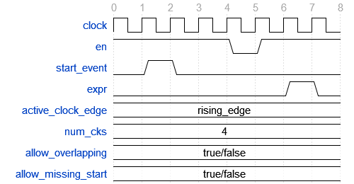

.. _check_library:

Check Library
=============

Introduction
------------

The check package is an assertion library for VHDL providing the more
commonly used assertions as a number of check procedures and functions.

Architecture
------------

The check subprograms are mainly a number conditional log messages. If
the condition represents a failing check then an error message is issued
using the VUnit :doc:`log package <../logging/user_guide>`. A passing
check has no effect other than updating the passing check statistics.

Every check you do is handled by a checker. There is a default checker
that is used when none is specified but you can also create multiple
custom checkers. For example

.. code-block:: vhdl

    check(re = '1', "Expected active read enable at this point");

will use the default checker while

.. code-block:: vhdl

    check(my_checker, re = '1', "Expected active read enable at this point");

will use the custom ``my_checker``. A checker is just a (shared)
variable

.. code-block:: vhdl

    variable my_checker : checker_t;

All procedures presented in this user guide are available for both the
default checker and the custom checkers. The difference is the first
``checker_t`` parameter which only exists for custom checker procedures.
To make the user guide more compact we present this as an optional
parameter using brackets. For example

.. code-block:: vhdl

    procedure checker_init (
     [variable checker       : inout checker_t;]
      constant default_level : in    log_level_t := error;
      variable logger        : inout logger_t);

The full verbose API description can always be found in
`check\_api.vhd <src/check_api.vhd>`__.

There are also a number of functions in the check package. These are
only available for the default checker and the reason is that
``checker_t`` is defined as a protected type in the VHDL 2002 and 2008
implementations. Protected types cannot be input to a function so in
these cases the check package will provide a procedure which will return
the same result in an output parameter.

Checker Initialization
----------------------

Since a check is a conditional log most of the checker initialization
parameters are the same as you'll find for logger initialization. These
parameters are described in the :doc:`log user
guide <../logging/user_guide>` and are used to initialize the
checker internal logger that outputs any error message. However, the
default values for ``file_name`` and ``display_format`` are different
and there is also a ``default_level`` parameter unique to
``checker_init``. ``default_level`` is used to specify the log level for
the error message unless specified in the check subprogram as explained
in the following chapters.

.. code-block:: vhdl

    procedure checker_init (
     [variable checker        : inout checker_t;]
      constant default_level  : in    log_level_t  := error;
      constant default_src    : in    string       := "";
      constant file_name      : in    string       := "error.csv";
      constant display_format : in    log_format_t := level;
      constant file_format    : in    log_format_t := off;
      constant stop_level     : in    log_level_t  := failure;
      constant separator      : in    character    := ',';
      constant append         : in    boolean      := false);

It is also possible to initialize a checker to use an already defined
logger using the following procedure

.. code-block:: vhdl

    procedure checker_init (
     [variable checker       : inout checker_t;]
      constant default_level : in    log_level_t := error;
      variable logger        : inout logger_t);

Basic Check
-----------

The check package provides a basic ``check`` procedure which is similar
to the VHDL ``assert`` statement

.. code-block:: vhdl

    check(re = '1', "Expected active read enable at this point");

The first parameter is the expression to check and the second parameter
is the error message issued if the expression is false. Assuming this
check fails and you've initialized the default checker with the default
values the error message will be

.. code-block:: console

    ERROR: Expected active read enable at this point

If you wish to have another log level than the default one set by
``checker_init`` you can override this for each check call. For example

.. code-block:: vhdl

    check(re = '1', "Expected active read enable at this point", failure);

A failing check is always counted as failing check regardless of the
level but the level affects whether or not the simulation stops as
controlled by the ``stop_level`` parameter to ``checker_init``.

Note that when using the VUnit Python test runner the default checker
``stop_level`` is set to ``error`` when calling ``test_runner_setup``.
The reason is that the Python test runner has the ability to restart the
simulation with the next test case so that all test cases are run
despite of an error while **guaranteeing** that the error state of the
failing test case doesn't propagate into the next. If you're not using
the Python test runner and have ``stop_level`` at ``failure`` as a way
to continue on ``error`` you don't have this guarantee.

Check Location
~~~~~~~~~~~~~~

The ``check`` procedure described in the previous section has two
additional parameters, ``line_num`` and ``file_name``. These are
normally not set by the user but by the location preprocessor such that
the location of a failing check is included in the error message. The
location preprocessor is further described in the :doc:`log user
guide <../logging/user_guide>`. Preprocessor parameters are always
placed at the end of the parameter list and they have "good" default
values such that the function behaves nicely even if the preprocessor
isn't used.

.. code-block:: vhdl

    procedure check(
     [variable checker   : inout checker_t;]
      constant expr      : in    boolean;
      constant msg       : in    string      := "Check failed!";
      constant level     : in    log_level_t := dflt;
      constant line_num  : in    natural     := 0;
      constant file_name : in    string      := "");

Acting on Failing Checks
~~~~~~~~~~~~~~~~~~~~~~~~

The ``check`` procedure described so far doesn't reveal whether the
check passed or not. If you want that information to control the flow of
your test and your testbench is setup to continue on a failing check you
have a number of options. You can use this procedure where the ``pass``
output is ``false`` on a failing check

.. code-block:: vhdl

    procedure check(
     [variable checker   : inout checker_t;]
     [variable pass      : out   boolean;]
      constant expr      : in    boolean;
      constant msg       : in    string      := "Check failed!";
      constant level     : in    log_level_t := dflt;
      constant line_num  : in    natural     := 0;
      constant file_name : in   string      := "");

or you can use this function which returns the same information

.. code-block:: vhdl

    impure function check(
      constant expr      : in  boolean;
      constant msg       : in  string      := "Check failed!";
      constant level     : in  log_level_t := dflt;
      constant line_num  : in  natural     := 0;
      constant file_name : in  string      := "")
      return boolean;

or you can see if there has been any errors so far

.. code-block:: vhdl

    procedure checker_found_errors (
     [variable checker : inout checker_t;]
      variable result  : out   boolean);

.. code-block:: vhdl

    impure function checker_found_errors
      return boolean;

or you can use any of the following subprograms to get more details.

.. code-block:: vhdl

    procedure get_checker_stat (
     [variable checker : inout checker_t;]
      variable stat    : out   checker_stat_t);

.. code-block:: vhdl

    impure function get_checker_stat
      return checker_stat_t;

``checker_stat_t`` is a record containing pass/fail information.

.. code-block:: vhdl

    type checker_stat_t is record
      n_checks : natural;
      n_failed : natural;
      n_passed : natural;
    end record;

Manage Checker Statistics
~~~~~~~~~~~~~~~~~~~~~~~~~

A checker will continuously update its statistics counters as new check
subprograms are called. If you want to collect the statistics for parts
of your test you can make intermediate readouts using the
``get_checker_stat`` subprograms and then reset the counters to zero
using

.. code-block:: vhdl

    procedure reset_checker_stat [(
      variable checker : inout checker_t)];

Another way of collecting statistics for different parts is to use
several separate checkers.

Variables of type ``checker_stat_t`` can be added to or subtracted from
each other using the normal ``-`` and ``+`` operators. There is also a
``to_string`` function defined to allow for logging/reporting of
statistics, for example

.. code-block:: vhdl

    info(to_string(get_checker_stat));

Specialized Checks
------------------

In addition to the basic check subprograms the check package also
provides a number of more specialized checks. These checks can be
divided into four different types

-  Point checks
-  Relation checks
-  Sequential checks
-  Unconditional checks

These types and the checks belonging to each type are described in the
following chapters.

Point Checks
~~~~~~~~~~~~

Common to all point checks is that the condition for failure is
evaluated at a single point in time, either when the subprogram is
called as part of sequential code or synchronous to a clock in a clocked
and usually concurrent procedure call. There are five unclocked versions
of each point check and they correspond to the function and four
procedures available for the basic check. The only difference to the
parameter lists is that the boolean ``expr`` parameter is replaced by
one or more parameters specific to the point check.

The unclocked procedures have the following format. The four variants
comes from the different combinations of using the two first optional
parameters.

.. code-block:: vhdl

    procedure check_<name>(
      [variable checker   : inout checker_t;]
      [variable pass      : out   boolean;]
      <specific parameters>
      constant msg       : in    string      := "Check failed!";
      constant level     : in    log_level_t := dflt;
      constant line_num  : in    natural     := 0;
      constant file_name : in    string      := "");

The function has the following format.

.. code-block:: vhdl

    impure function check_<name>(
      <specific parameters>
      constant msg       : in  string      := "Check failed!";
      constant level     : in  log_level_t := dflt;
      constant line_num  : in  natural     := 0;
      constant file_name : in  string      := "")
      return boolean;

The clocked procedures come from the following format with and without
the optional parameter.

.. code-block:: vhdl

    procedure check_<name>(
     [variable checker           : inout checker_t;]
      signal clock               : in    std_logic;
      signal en                  : in    std_logic;
      <specific parameters>
      constant msg               : in    string      := "Check failed!";
      constant level             : in    log_level_t := dflt;
      constant active_clock_edge : in    edge_t      := rising_edge;
      constant line_num          : in    natural     := 0;
      constant file_name         : in    string      := "");

``edge_t`` is an enumerated type:

.. code-block:: vhdl

    type edge_t is (rising_edge, falling_edge, both_edges);

The condition for failure is continuously evaluated on the clock edge(s)
specified by ``active_clock_edge`` as long as ``en = '1'``.

The figure below shows an example using the concurrent version of
``check_true`` which evaluates a boolean ``expr`` just like the basic
check. The only difference is that ``check_true`` provides the two
concurrent procedure formats which the basic check does not.

.. figure:: images/check_true.png
   :alt:

``expr`` is evaluated on every rising clock edge except for edge 3 where
``en`` is low. This means that the check doesn't fail despite the clock
cycle where ``expr`` is false.

check\_true
^^^^^^^^^^^

+---------------------+-------------------------+
| Special Parameter   | Type                    |
+=====================+=========================+
| expr                | boolean or std\_logic   |
+---------------------+-------------------------+

``check_true`` passes when ``expr`` is ``true``/``1``/``H``.

check\_false
^^^^^^^^^^^^

+---------------------+-------------------------+
| Special Parameter   | Type                    |
+=====================+=========================+
| expr                | boolean or std\_logic   |
+---------------------+-------------------------+

``check_false`` passes when ``expr`` is ``false``/``0``/``L``.

check\_implication
^^^^^^^^^^^^^^^^^^

+---------------------+-------------------------+
| Special Parameter   | Type                    |
+=====================+=========================+
| antecedent\_expr    | boolean or std\_logic   |
+---------------------+-------------------------+
| consequent\_expr    | boolean or std\_logic   |
+---------------------+-------------------------+

The unclocked subprograms use ``boolean`` parameters while the clocked
procedures use ``std_logic``.

``check_implication`` checks logical implication and passes unless
``antecedent_expr`` is ``true``/``1``/``H`` and ``consequent_expr`` is
``false``/``0``/``L``.

check\_not\_unknown
^^^^^^^^^^^^^^^^^^^

+---------------------+------------------------------------+
| Special Parameter   | Type                               |
+=====================+====================================+
| expr                | std\_logic\_vector or std\_logic   |
+---------------------+------------------------------------+

``check_not_unknown`` passes when ``expr`` contains none of the
metavalues ``U``, ``X``, ``Z``, ``W``, or ``-``.

check\_zero\_one\_hot
^^^^^^^^^^^^^^^^^^^^^

+---------------------+----------------------+
| Special Parameter   | Type                 |
+=====================+======================+
| expr                | std\_logic\_vector   |
+---------------------+----------------------+

``check_zero_one_hot`` passes when ``expr`` contains none of the
metavalues ``U``, ``X``, ``Z``, ``W``, or ``-`` and there are zero or
one bit equal to ``1`` or ``H`` .

check\_one\_hot
^^^^^^^^^^^^^^^

+---------------------+----------------------+
| Special Parameter   | Type                 |
+=====================+======================+
| expr                | std\_logic\_vector   |
+---------------------+----------------------+

``check_one_hot`` passes when ``expr`` contains none of the metavalues
``U``, ``X``, ``Z``, ``W``, or ``-`` and there is exactly one bit equal
to ``1`` or ``H`` .

Relation Checks
~~~~~~~~~~~~~~~

Relation checks are used to check whether or not a relation holds
between two expressions, for example if ``(a + b) = c``. They support
the following five unclocked formats.

.. code-block:: vhdl

    procedure check_<name>(
     [variable checker         : inout checker_t;]
     [variable pass            : out boolean;]
      <specific parameters>
      constant msg             : in string := "";
      constant level           : in log_level_t := dflt;
      <preprocessor parameters>);

.. code-block:: vhdl

    impure function check_<name>(
      <specific parameters>
      constant msg             : in string := "";
      constant level           : in log_level_t := dflt;
      <preprocessor parameters>)
      return boolean;

Note the difference in default value for ``msg`` when compared to the
point checks. Point checks have ``Check failed!`` as default while
relation checks use an empty string. The reason is that relation checks
generate error messages of their own that describes how the relation
failed. Any ``msg`` input provided by the user is added to that error
message as additional information.

There's also a difference in the preprocessor parameters.
``check_equal`` and ``check_match`` have the ``line_num`` and
``file_name`` parameters just as the point checks but ``check_relation``
also has a parameter called ``auto_msg`` described later.

check\_equal
^^^^^^^^^^^^
+------------------+
| Special Parameter|
+==================+
| got              |
+------------------+
| expected         |
+------------------+

The ``got`` and ``expected`` parameters can have the following
combination of types

+----------------------+----------------------+
| got                  | expected             |
+======================+======================+
| unsigned             | unsigned             |
+----------------------+----------------------+
| natural              | unsigned             |
+----------------------+----------------------+
| unsigned             | natural              |
+----------------------+----------------------+
| std\_logic\_vector   | std\_logic\_vector   |
+----------------------+----------------------+
| std\_logic\_vector   | unsigned             |
+----------------------+----------------------+
| unsigned             | std\_logic\_vector   |
+----------------------+----------------------+
| signed               | signed               |
+----------------------+----------------------+
| integer              | signed               |
+----------------------+----------------------+
| signed               | integer              |
+----------------------+----------------------+
| integer              | integer              |
+----------------------+----------------------+
| std\_logic           | std\_logic           |
+----------------------+----------------------+
| boolean              | std\_logic           |
+----------------------+----------------------+
| std\_logic           | boolean              |
+----------------------+----------------------+
| boolean              | boolean              |
+----------------------+----------------------+

+--------------------------+-----------+-----------------+
| Preprocessor Parameter   | Type      | Default Value   |
+==========================+===========+=================+
| line\_num                | natural   | 0               |
+--------------------------+-----------+-----------------+
| file\_name               | string    | ""              |
+--------------------------+-----------+-----------------+

``check_equal`` passes when ``got`` equals ``expected``. When comparing
``std_logic`` values with ``boolean`` values ``1`` equals ``true`` and
``0`` equals ``false``. Note that the ``std_logic`` don't care (``-``)
only equals itself. If you want an equality like ``"0011" = "00--"`` to
pass you should use ``check_relation`` with the matching equality
operator (``?=``) or ``check_match`` instead.

If an check fails you will get an error message on the following format.

.. code-block:: console

    ERROR: Equality check failed! Got <got value>. Expected <expected value>. <msg input string if any>.

When you compare bit vectors, ``integer`` and ``natural`` type of values
the error message will output the values on both formats. For example,
here is an error message when a ``check_equal`` between a ``signed`` and
an ``integer`` value fails.

.. code-block:: console

    ERROR: Equality check failed! Got -256 (1_0000_0000). Expected 1010_0101 (-91).

check\_relation
^^^^^^^^^^^^^^^

+---------------------+--------------------------------+
| Special Parameter   | Type                           |
+=====================+================================+
| expr                | boolean, std\_ulogic, or bit   |
+---------------------+--------------------------------+

+--------------------------+-----------+-----------------+
| Preprocessor Parameter   | Type      | Default Value   |
+==========================+===========+=================+
| auto\_msg                | string    | ""              |
+--------------------------+-----------+-----------------+
| line\_num                | natural   | 0               |
+--------------------------+-----------+-----------------+
| file\_name               | string    | ""              |
+--------------------------+-----------+-----------------+

``expr`` is intended to be a relational expression and three different
types are supported. In case a matching relational operator is used the
relation will return a ``std_ulogic`` or ``bit`` depending on the
operands. All other relations will return a boolean.

``check_relation`` passes when ``expr`` evaluates to ``true`` in the
boolean case and to ``1`` in the ``std_ulogic`` and ``bit`` cases. This
means that the ``boolean`` case behaves just like ``check_true``. The
additional value of this check comes when you enable the check
preprocessor in your VUnit run script.

.. code-block:: python

    ui = VUnit.from_argv()
    ui.enable_check_preprocessing()

The check preprocessor scans your code for calls to ``check_relation``
and then parses ``expr`` as a VHDL relation. From that it will generate
an error message describing how the relation failed. For example, the
check

.. code-block:: vhdl

    check_relation(real_time_clock <= timeout, "Response too late.");

will generate the following error message if it fails.

.. code-block:: console

    ERROR: Relation real_time_clock <= timeout failed! Left is 23:15:02. Right is 23:15:04. Response too late.

This works for **any** type of relation between **any** types as long as
the operator and the ``to_string`` function are defined for the types
involved. In the example the operands are of a custom ``clock_t`` for
which both the ``<=`` operator and the ``to_string`` function have been
defined.

In addition to the ``line_num`` and ``file_name`` preprocessor
parameters all ``check_relation`` subprograms have another preprocessor
parameter ``auto_msg`` which is set by the check preprocessor and forms
the first sentence of the error message. ``auto_msg`` is the empty
string by default so without the check preprocessor the error message
will be just the ``msg`` provided by the user

Relations with Side Effects
'''''''''''''''''''''''''''

The left and right hand sides of the relation are evaluated twice, once
when the relation is evaluated and once to create the error message so
if you have a call like this

.. code-block:: vhdl

    check_relation(counter_to_verify = get_and_increment_reference_counter(increment_with => 3));

The reference counter will be incremented with 6 which is not what you
expect by just looking at the code before the preprocessor has generated
the ``auto_msg`` which will be a string containing
``to_string(get_and_increment_reference_counter(increment_with => 3))``.

Conclusion: Do not use impure functions in your expression. If you have
a case like this you can do something like

.. code-block:: vhdl

    ref_cnt := get_and_increment_reference_counter(increment_with => 3);
    check_relation(counter_to_verify = ref_cnt);

or since this is an equality relation, probably between standard
countable types, use ``check_equal`` instead. ``check_equal`` has the
left and right hand operands separated in the call itself so in that
case there is no need for a second evaluation in order to create the
error message.

Fooling the Parser
''''''''''''''''''

The check preprocessor has a simplified parser to determine what the
relation operator in the expression is and what the left and right hand
operands are. For example, it knows that this is an inequality since
that is the only relational operator on the "top-level".

.. code-block:: vhdl

    check_relation((a = b) /= (c = d));

It also knows that this isn't a relation since there's no relational
operator on the top-level.

.. code-block:: vhdl

    check_relation((a = b) and c);

This will result in a syntax error from the check preprocessor

.. code-block:: console

    SyntaxError: Failed to find relation in check_relation((a = b) and c)

However, its knowledge about precedence is limited to parenthesis so it
will not understand that this identical expression isn't a relation.

.. code-block:: vhdl

    check_relation(a = b and c);

If this logical expression returns false the check will generate an
error message claiming that a relation failed and that ``to_string(a)``
was the left value and ``to_string(b and c)`` was the right value.

Conclusion: Use ``check_relation`` for relations as intended!

The `check example
testbench <../../../examples/vhdl/check/check_example.vhd>`__ also
contain another highly unlikely way to fool the parser.

It should also be noted that the parser can handle that there are
relational operators within the check call but outside of the ``expr``
parameter. For example, it won't be fooled by the relational operators
appearing within strings and comments of this call.

.. code-block:: vhdl

    check_relation(len("""Heart"" => <3") = -- The string contains <, so does
                                            -- this comment
                   12, "Incorrect length of ""<3 string"".");

check\_match
^^^^^^^^^^^^

+------------------+
| Special Parameter|
+==================+
| got              |
+------------------+
| expected         |
+------------------+

The ``got`` and ``expected`` parameters can have the following
combination of types

+----------------------+----------------------+
| got                  | expected             |
+======================+======================+
| unsigned             | unsigned             |
+----------------------+----------------------+
| std\_logic\_vector   | std\_logic\_vector   |
+----------------------+----------------------+
| signed               | signed               |
+----------------------+----------------------+
| std\_logic           | std\_logic           |
+----------------------+----------------------+

+--------------------------+-----------+-----------------+
| Preprocessor Parameter   | Type      | Default Value   |
+==========================+===========+=================+
| line\_num                | natural   | 0               |
+--------------------------+-----------+-----------------+
| file\_name               | string    | ""              |
+--------------------------+-----------+-----------------+

``check_match`` passes when ``got`` equals ``expected`` but differs from
``check_equal`` in that a don't care (``-``) bit equals anything.

Sequence Checks
~~~~~~~~~~~~~~~

Sequence checks are checks that use several clock cycles to determine
whether or not the desired property holds.

check\_stable
^^^^^^^^^^^^^

``check_stable`` supports four different clocked formats. The ``expr``
parameter can be ``std_logic`` or ``std_logic_vector`` and the call can
be made with or without the initial custom checker parameter.

.. code-block:: vhdl

    procedure check_stable(
     [variable checker           : inout checker_t;]
      signal clock               : in    std_logic;
      signal en                  : in    std_logic;
      signal start_event         : in    std_logic;
      signal end_event           : in    std_logic;
      signal expr                : in    std_logic or std_logic_vector;
      constant msg               : in    string      := "Check failed!";
      constant level             : in    log_level_t := dflt;
      constant active_clock_edge : in    edge_t      := rising_edge;
      constant line_num          : in    natural     := 0;
      constant file_name         : in    string      := "");

``check_stable`` passes if the ``expr`` parameter is stable in the
window defined by the ``start_event`` and ``end_event`` parameters. The
window starts at an active (according to ``active_clock_edge``) and
enabled (``en = '1'``) clock edge for which ``start_event = '1'`` and it
ends at the next active and enabled clock edge for which
``end_event = '1'``. ``expr`` is sampled for a reference value at the
start event and is considered stable if it keeps that reference value at
all enabled active clock edges within the window, including the clock
edge for the end event. Bits within ``expr`` may change drive strength
(between ``'0'`` and ``'L'`` or between ``'1'`` and ``'H'``) and still be considered
stable. Below is an example with two windows that will pass.

.. figure:: images/check_stable_passing.png
   :alt:

Here are two examples of failing checks. Note that any unknown value
(``U``, ``X``, ``Z``, ``W``, or ``-``) will cause the check to fail even
if the unknown value is constant. The check will also fail if
``start_event`` or ``end_event`` in an active window has an unknown
value.

.. figure:: images/check_stable_failing.png
   :alt:

``check_stable`` can handle one clock cycle windows and back-to-back
windows. If a second window is started before the previous is completed
the second start event will be ignored and the window will be completed
by the next end event.

check\_next
^^^^^^^^^^^

``check_next`` supports two different formats. One with and one without
the initial custom checker parameter.

.. code-block:: vhdl

    procedure check_next(
     [variable checker             : inout checker_t;]
      signal clock                 : in    std_logic;
      signal en                    : in    std_logic;
      signal start_event           : in    std_logic;
      signal expr                  : in    std_logic;
      constant msg                 : in    string      := "Check failed!";
      constant num_cks             : in    positive    := 1;
      constant allow_overlapping   : in    boolean     := true;
      constant allow_missing_start : in    boolean     := true;
      constant level               : in    log_level_t := dflt;
      constant active_clock_edge   : in    edge_t      := rising_edge;
      constant line_num            : in    natural     := 0;
      constant file_name           : in    string      := "");

``check_next`` passes if ``expr = '1'`` ``num_cks`` active (according to
``active_clock_edge``) and enabled (``en = '1'``) clock edges after a
start event. The start event is defined by an active and enabled clock
edge for which ``start_event = '1'``. Below is an example of a passing
check. The start event is sampled at clock edge two. ``expr`` is
expected to be high four enabled clock edges after that which is at
clock edge seven due to ``en`` being low at clock edge five.

When ``allow_overlapping`` is ``true`` ``check_next`` will allow a new
start event before the check based on the previous start event has been
completed. Here is an example with two overlapping and passing
sequences.

.. figure:: images/check_next_passing_with_overlap.png
   :alt:

In case ``allow_overlapping`` is ``false`` ``check_next`` will fail at
the second start event

When ``allow_missing_start`` is ``true`` ``check_next`` will allow
``expr = '1'`` when there is no corresponding start event. When
``allow_missing_start`` is ``false`` such a situation will lead to a
failure.

``check_next`` will handle the weak values ``L`` and ``H`` in the same
way as ``0`` and ``1``, respectively.

check\_sequence
^^^^^^^^^^^^^^^

``check_sequence`` supports two different formats. One with and one
without the initial custom checker parameter.

.. code-block:: vhdl

    procedure check_sequence(
     [variable checker             : inout checker_t;]
      signal clock                 : in    std_logic;
      signal en                    : in    std_logic;
      signal event_sequence        : in    std_logic_vector;
      constant msg                 : in    string          := "Check failed!";
      constant trigger_event       : in    trigger_event_t := penultimate;
      constant level               : in    log_level_t     := dflt;
      constant active_clock_edge   : in    edge_t          := rising_edge;
      constant line_num            : in    natural         := 0;
      constant file_name           : in    string          := "");

``check_sequence`` passes if a number of events, represented by the bits
in the ``event_sequence`` parameter, are activated (bit = ``'1'`` or
``'H'``) in sequence at consecutive active (according to
``active_clock_edge``) and enabled (``en = '1'``) clock edges.
``check_sequence`` supports three different modes of operation as
controlled by the ``trigger_event`` parameter:

-  ``first_pipe`` - The sequence is started when the leftmost bit of
   ``event_sequence`` is activated. This will also trigger
   ``check_sequence`` to verify that the remaining bits are activated at
   the following active and enabled clock edges. ``check_sequence`` will
   also verify new sequences starting before the first is completed.

The figure below shows two overlapping sequences that pass.

.. figure:: images/check_sequence_first_pipe_passing.png
   :alt:

In this example the sequence is started but not completed and the check
fails.

.. figure:: images/check_sequence_first_pipe_failing.png
   :alt:

-  ``first_no_pipe`` - Same as ``first_pipe`` with the exception that
   only one sequence is verified at a time. New sequences starting
   before the previous is verified will be ignored.

In this example we have two sequences, the first is completed while the
second is interrupted. However, since only one sequence is handled at a
time the second is ignored and the check pass.

.. figure:: images/check_sequence_first_no_pipe_passing.png
   :alt:

-  ``penultimate`` - The difference with the previous modes is that
   ``check_sequence`` only verifies the last event (the rightmost bit)
   when all the preceding events in the sequence have been activated.
   This means that a started sequence that is interrupted before the
   second to last bit is activated will pass. ``check_sequence`` will
   also verify new sequences starting before the first is completed.

The figure below shows two overlapping sequences which pass and then an
early interrupted sequence that doesn't cause a failure in this mode
(which it did in the example for the ``first_pipe`` mode.

.. figure:: images/check_sequence_penultimate_passing.png
   :alt:

In this example the sequence is interrupted after the second to last bit
is activated and the check fails.

.. figure:: images/check_sequence_penultimate_failing.png
   :alt:

Unconditional Checks
~~~~~~~~~~~~~~~~~~~~

The check package has two unconditional checks, ``check_passed`` and
``check_failed``, that contains no expression parameter to evaluate.
They are used when the pass/fail status is already given by the program
flow. For example,

.. code-block:: vhdl

    if <some condition> then
      <do something>
      check_passed;
    else
      <do something else>
      check_failed("This was not expected");
    end if;

With no ``expr`` parameter there are also fewer usable formats for these
checkers.

.. code-block:: vhdl

    procedure check_passed [(
      variable checker   : inout checker_t)];

.. code-block:: vhdl

    procedure check_failed(
     [variable checker   : inout checker_t;]
      constant msg       : in    string      := "Check failed!";
      constant level     : in    log_level_t := dflt;
      constant line_num  : in    natural     := 0;
      constant file_name : in    string      := "");
