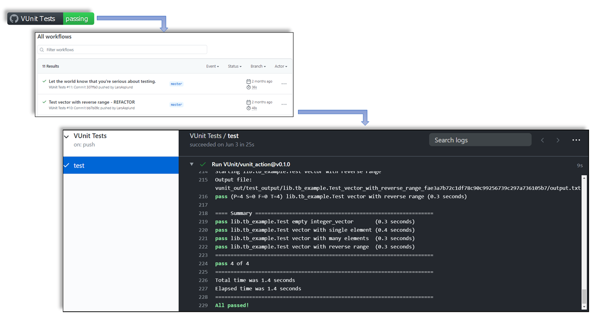

.. _continuous_integration:script:

Setup/configuration scripts
###########################

Keeping testing environments up to date with rapidly evolving tools can be time-consuming and can lead to frustration. In this
section, scripts and configuration tools to automate the setup and/or configuration of simulators and VUnit are presented.

.. _continuous_integration:gha:

GitHub Actions
**************

GitHub's CI/CD service is named `GitHub Actions <https://github.com/features/actions>`_ (GHA). It allows to create automated
*workflows* for your repositories, which are defined through `YAML <https://en.wikipedia.org/wiki/YAML>`_ files. Workflows
can be triggered by any event, such as push, issue creation or publication of releases.

GHA provides virtual machines with GNU/Linux (Ubuntu), Windows or macOS. Hence, it is possible to write the steps/tasks using
the default shells/terminals (*bash*, *powershell*, etc.), as in any other CI/CD service. By the same token, any language can
be used (Python, JavaScript, Ruby, Go, Rust, etc.). However, there are also predefined tasks named *Actions*. Those are
written either in *JavaScript/TypeScript* (for any OS) or packaged in a *Container Action* (GNU/Linux only). Some Actions are
provided by GitHub (see `github.com/actions <https://github.com/actions>`_), and some are published in the
`GitHub marketplace <https://github.com/marketplace?type=actions>`_. Nevertheless, any GitHub repository can contain *Actions*.

Hence, the recommended procedure to create workflows is to pick and reuse existing Actions
(see `docs.github.com/actions <https://docs.github.com/actions>`_).

Anyway, when further customization is required, the procedures explained in sections *Containers and/or Virtual Machines* and/or
*Manual setup* can also be used in GHA workflows.

.. NOTE:: Implementation differences between *JavaScript* and *Container* actions can be found at
   `docs.github.com/actions/creating-actions <https://docs.github.com/actions/creating-actions>`_.

.. NOTE:: GitHub Actions is free (as in *free beer*) for public (open source) repositories. For private repositories,
   2000-3000 minutes are included per month. See section "*Simple, pay-as-you-go pricing*" at `GitHub Actions <https://github.com/features/actions>`_.

.. _continuous_integration:gha:vunit:

VUnit Action
============

`VUnit Action <https://github.com/VUnit/vunit_action>`_ is a reusable *Action*, which is published in the marketplace
(`github.com/marketplace/actions/vunit-action <https://github.com/marketplace/actions/vunit-action>`_). It helps you build a
workflow for running your HDL testbenches, and then present the results.

To use *VUnit Action* for your project, you need to create a `YAML <https://en.wikipedia.org/wiki/YAML>`_ file (``some_name.yml``)
and place that in a directory named ``.github\workflows`` (located directly under your project root), in the default branch
of your repository. The YAML file should contain, at least, the following piece of code.

.. code-block:: yaml

   name: VUnit Tests

   on:
     push:
     pull_request:

   jobs:

     test:
       runs-on: ubuntu-latest
       steps:

         - uses: actions/checkout@v2

         - uses: VUnit/vunit_action@v0.1.0

.. IMPORTANT:: Currently, VUnit Action is implemented as a *Container Action*. As a result, tests are executed in a Docker/OCI
   container, regardless of the CI/CD *host* being `ubuntu-latest`.

Whenever someone pushes code to the project or makes a pull request, this workflow is triggered. First, the code is checked
out using the `checkout action <https://github.com/marketplace/actions/checkout>`_. Then, the *VUnit Action* is triggered,
to run the ``run.py`` script located in the root of your repository. If the VUnit run script is located elsewhere, you specify
it in the YAML file:

.. code-block:: yaml

   - uses: VUnit/vunit_action@v0.1.0
     with:
       run_file: path/to/vunit_run_script.py

To build trust with the user community by clearly showing that you have tests up and running, we recommend that you add a
badge/shield to the README of your project. It will show the latest status of you tests:

.. code-block:: md

   

.. HINT:: `shields.io <https://shields.io/>`_ is another badge/shield provider which allows customizing some characteristics,
   such as shape, color, labels, icons, etc. When combining shields corresponding to different services, it is suggested to
   use *shields.io* in order to get an homogeneous result. Moreover, *shields.io* provides ready-to-copy snippets for multiple
   languages (Markdown, reStructuredText, HTML, etc.).

Clicking the badge/shield will take you to a list of workflow runs, and then further to the results of those runs:

   Presenting GHA test results.

Self-hosted runners
===================

By default, GitHub Actions workflows are executed on GitHub's servers. However, it is possible to setup so-called
*self-hosted runners*. Those are machines owned by users/developers/organizations/companies, where a client service is
executed. Then, users can assign specific workflows to be executed on self-hosted runners. See `docs.github.com/actions/hosting-your-own-runners <https://docs.github.com/actions/hosting-your-own-runners>`_.

As explained in `docs.github.com/actions/hosting-your-own-runners: Self-hosted runner security with public repositories <https://docs.github.com/actions/hosting-your-own-runners/about-self-hosted-runners#self-hosted-runner-security-with-public-repositories>`_,
it is strongly discouraged to use self-hosted runners with public repositorites, in order to avoid PRs executing potentially
dangerous code. That is mainly because self-hosted runners have access to the tools available on the host. Yet, for that same
reason, using self-hosted runners is a suitable solution for having CI with non-FLOSS simulators.

.. IMPORTANT:: VUnit is currently tested in CI with GHDL only. Specific companies provide a limited set of licenses for
   non-FLOSS simulators, which some developers can use locally. Ideally, companies interested in supporting VUnit would
   provide a machine to serve a self-hosted runner in a private fork. If you want to contribute, get in touch!
