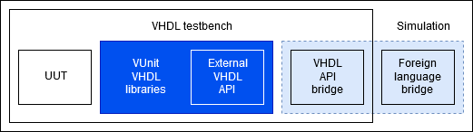

In version 4.3.0 the prototype of an external VHDL API was introduced. This experimental feature exposes a subset of resources from some of VUnit's internal data types. Creation functions for these data types accept two new optional parameters:

* **mode**: selects between *internal* (default), external access (*extacc*) or external function (*extfnc*).
* **eid**: when the selected mode is external, this parameter is to be used between VHDL and the foreign language as a unique identifier for the vector.

In mode *extacc*, VHDL retrieves a pointer to an already allocated buffer, and then data is directly read/written from VHDL. Hence, it is required for the pointer, that must be allocated externally, to be accesible to both the VHDL and the foreign language. The expected use case for this mode is to wrap the VHDL simulation in C/C++ or Python, so that the simulation is a child of the main process.

Conversely, mode *extfnc* is to be used when data is not available in the same memory space where the VHDL simulation is executed. Each time a value needs to be read/written, a function callback is executed (``read_*``/``write_*``), providing ``eid`` as an argument.

List of types that are currently in the external VHDL API:

* **string_ptr**, and **byte_vector_ptr** as an alias (:ref:`External string API <ext_string_pkg>`)
* **integer_vector_ptr** (:ref:`External integer vector API <ext_integer_vector_pkg>`)

.. important:: By default, bodies of the external API functions/procedures include forced failure assertions. Hence, using ``mode/=internal`` without providing a *bridge* to a foreign language will make tests fail. Bridges must be provided through `vu.add_vhdl_builtins(external=<Options>)`, where `<Options>` defaults to ``{"string": False, "integer_vector": False}``. Each field should contain a list of VHDL files to replace the *dummy* default. See `VUnit/cosim <https://github.com/VUnit/cosim>`_ for reference implementations of bridges and examples.

.. toctree::
   :hidden:

   ext_string
   ext_integer_vector
