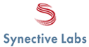
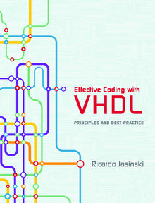
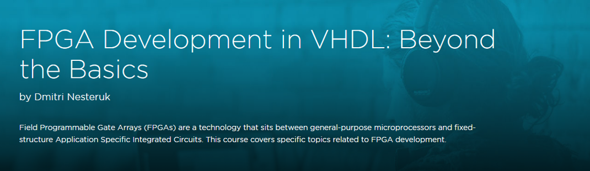

.. role:: raw-html(raw)
   :format: html

Testimonials
============

Professionals
-------------

:raw-html:`
<i style="font-size:150%;">"VUnit significantly speeds up the code/compile/test cycle and lowers the effort to create and maintain thousands of automated test cases. Together with modern tools like Sigasi Studio and Jenkins it enables us to leverage the best practices of software development in the VHDL domain."</i>  &#x2015; Olof Kraigher, Manager FPGA & Embedded Software, Autoliv   
`

:raw-html:`
<i style="font-size:150%;">"VUnit is great"</i>  &#x2015; Guy Eschemann, FPGA consultant, developer of airhdl.com   
`

:raw-html:`
<i style="font-size:150%;">"VUnit has enabled us to maintain an extensive algorithmic regression test suite for a VHDL design that was ported to several different FPGA vendors and families, as well as to a digital ASIC."</i>  &#x2015; Gunnar Stjernberg, FPGA and ASIC developer, Synective Labs   
`

Education
---------

:raw-html:`
<i style="font-size:150%;">"For VHDL, the most advanced framework is VUnit"</i>  &#x2015; Ricardo Jasinski, Author of Effective Coding with VHDL   
`

:raw-html:`
<i style="font-size:150%;">"VUnit makes it a lot easier to test the code"</i>  &#x2015; Dmitri Nesteruk, FPGA course instructor at Pluralsight   
`

:raw-html:`
<i style="font-size:150%;">"VUnit is a great framework that makes possible CI principles in the field of VHDL/SystemVerilog projects design not only for industry, but for educational process as well."</i>  &#x2015; Vitalii Kulanov, Associate Professor at the Department of Computer Systems and Networks, KhAI   
`

Organizations
-------------

:raw-html:`
VUnit is the verification platform chosen by the VHDL standardization group to verify the upcoming VHDL-2017 standard
 `

Tool Providers
--------------

:raw-html:`
<i style="font-size:150%;">"(J)Unit testing is an essential tool for the development of Sigasi Studio. It helps us to smoothly add new features without breaking existing features. Thanks to VUnit, Sigasi Studio users can now enjoy these same benefits for their HDL designs"</i>  &#x2015; Hendrik Eeckhaut, Co&#x2010;founder and CTO of Sigasi   
`
